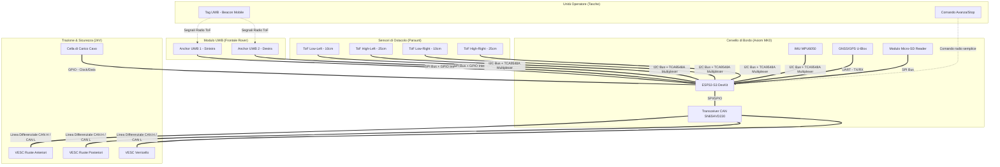

# Architettura Axiom Rover "Mulo" - MK0 (Mark 0)

L'architettura **MK0** rappresenta la variante "Hardware Robusto" ad alta affidabilita' per l'Axiom Rover "Mulo".

A differenza dei modelli che utilizzano computer di bordo generici (soggetti a crash, tempi di boot lunghi e consumo elevato), l'MK0 adotta un approccio **embedded e "Linux-free" per il controllo critico**, basato su microcontrollore **ESP32-S3** coadiuvato da sensori dedicati per la navigazione trail-following locale.

L'obiettivo non e' realizzare il rover piu' economico possibile: il criterio corretto e' il **miglior trade-off costo/robustezza**. Si risparmia su cio' che non compromette la missione, ma si investe senza esitazione su inseguimento affidabile dell'operatore, sicurezza, carico utile, dissipazione termica, connettori, protezioni elettriche e componenti meccanici soggetti a fatica.

---

## 0. Filosofia di Progetto MK0

Le priorita' del modello MK0 sono, in ordine:

1.  **Follow-me affidabile:** il rover deve seguire l'operatore a passo umano usando il link radio/UWB come riferimento relativo principale. Il GPS/GNSS serve per traccia, coordinate, geofence, recupero posizione e avanzamento assistito su percorso, non come sensore primario di inseguimento.
2.  **Robustezza meccanica e carico:** telaio, snodi, supporti ruota, alberi, cuscinetti e freni vengono dimensionati per urti, vibrazioni e carichi reali da trekking, non per banco prova.
3.  **Affidabilita' elettrica:** cablaggi corti, CAN bus robusto, alimentazioni protette, fusibili, sezionatore, watchdog e connettori bloccabili/IP-rated hanno priorita' rispetto al puro risparmio.
4.  **Dissipazione e derating:** motori, VESC, batteria e dump load devono poter lavorare in salita lenta e discesa prolungata senza andare in thermal runaway o tagliare potenza in modo improvviso.
5.  **Manutenibilita':** acciaio saldabile, componenti reperibili, pinze freno regolabili, cuscinetti standard e log diagnostici semplici rendono il rover riparabile anche lontano dal laboratorio.

---

## 1. Schema di Collegamento Hardware (Wiring Diagram)

Il sistema elimina la complessità dei cavi USB ed Ethernet a favore di bus industriali robusti come **CAN Bus** (per il controllo dei motori) e **I2C/SPI/UART** per i sensori.



---

## 2. Follow-Me Radio, GPS e Avanzamento Percorso

Il requisito operativo e' che il rover segua l'operatore in modo prevedibile e robusto tramite radio/UWB. Il GPS/GNSS non e' il sensore primario del follow-me: viene usato per sapere dove si trova il rover, salvare la traccia del percorso e abilitare funzioni semplici di richiamo/avanzamento.

| Sorgente | Ruolo Primario | Nota di Progetto |
| :--- | :--- | :--- |
| **UWB / radio tag-anchor** | Posizione relativa dell'operatore a corto raggio | Sensore principale per il follow-me locale, perche' misura distanza e direzione rispetto al rover. |
| **GNSS/GPS** | Coordinate, traccia GPX, geofence e percorso registrato | Deve dire dove si trova il rover e dove e' passato. Non deve comandare da solo il follow-me ravvicinato. |
| **IMU** | Assetto, pendenza, vibrazioni, anti-ribaltamento | Preferibile una IMU piu' stabile del solo MPU6050 per uso reale outdoor. |
| **Odometria motori/VESC** | Velocita' e coerenza movimento | Usata per rilevare slittamento, stallo, perdita trazione e comandi non coerenti. |
| **Comando operatore** | Avanza, pausa, stop, rientro semplice | Pulsante o telecomando essenziale, sempre subordinato alle sicurezze. |

La policy consigliata e':

- UWB valido e coerente: il rover segue l'operatore mantenendo distanza e angolo target.
- UWB degradato: il rover rallenta o si ferma, usando GPS solo per registrare posizione e aiutare il recupero.
- GPS degradato: il follow-me radio puo' continuare a bassa velocita', ma logging/geofence/avanzamento percorso vengono marcati non affidabili.
- Pendenza, corrente o temperatura fuori soglia: il rover riduce coppia/velocita' o arresta il movimento indipendentemente dal target.

### Modalita' "Avanza sul Percorso"

Una funzione utile e semplice per MK0 e' un comando operatore tipo **Avanza**:

1.  Durante il cammino il rover registra la traccia GPS/GNSS su SD card come lista di punti.
2.  Quando l'operatore preme **Avanza**, il rover procede lentamente verso il prossimo punto o segmento della traccia.
3.  Il movimento resta limitato in velocita' e distanza: se perde coerenza tra GPS, odometria e IMU, si ferma.
4.  Un secondo comando **Stop/Pausa** interrompe subito il movimento; l'E-stop fisico resta indipendente e prioritario.

Questa modalita' non sostituisce l'autonomia completa: serve per far avanzare il rover lungo un percorso gia' noto o appena registrato, con comportamento prevedibile e facile da collaudare.

## 3. Geometria del Follow-Me: Trilaterazione UWB

Il sistema di tracciamento radio si basa su due ricevitori (Anchors) posizionati sul frontale del rover a distanza nota $W$ (Larghezza del muso, es. $W = 60\text{ cm}$).

```
       [Anchor 1 (SX)]   <---   W   --->   [Anchor 2 (DX)]
            (-W/2, 0)                           (W/2, 0)
                \                                  /
                 \                                /
               d1 \                              / d2
                   \                            /
                    \                          /
                     \                        /
                      v                      v
                            [Tag (Operatore)]
                                 (x, y)
```

### Formule Geometriche
Definendo l'origine (0, 0) al centro del muso del rover:
*   A₁ = (-W/2, 0)
*   A₂ = (W/2, 0)

Misurando le distanze d₁ (da Tag ad Anchor 1) e d₂ (da Tag ad Anchor 2), le coordinate cartesiane (x, y) dell'operatore rispetto al rover sono calcolate tramite la trilaterazione:

```
x = (d₁² - d₂²) / (2 * W)
y = √(d₁² - (x + W/2)²)
```

Il vettore di inseguimento è definito da:
*   **Distanza Relativa (D):** D = √(x² + y²)
*   **Angolo di Deviazione (theta):** theta = arctan2(x, y) (in radianti)

---

## 4. Logica Firmware: Filtro degli Ostacoli e Traversabilità

Il rover non deve evitare ogni piccolo ostacolo. Sfruttando le ruote da 20", i sassi al di sotto dei 15 cm vengono scavalcati di potenza.

### Configurazione dei Sensori ToF
*   **Sensori Low (TLL / TLR):** Montati a **10 cm** da terra. Rilevano il profilo geometrico immediato del sentiero.
*   **Sensori High (THL / THR):** Montati a **25 cm** da terra (in corrispondenza dell'asse della ruota). Rilevano ostacoli insormontabili.

### Matrice di Decisione Software
L'ESP32 implementa la seguente logica a stati per il filtraggio ostacoli:

| Stato ToF Basso (10 cm) | Stato ToF Alto (25 cm) | Interpretazione Ostacolo | Azione Software |
| :--- | :--- | :--- | :--- |
| Libero (>1.5m) | Libero (>1.5m) | Strada pulita | Segue il Tag UWB normalmente. |
| Rilevato (<1.5m) | Libero (>1.5m) | Sasso basso / Ramo (<15cm) | **Ignora ostacolo**. Aumenta la coppia del 15% (Climbing Mode). |
| Rilevato (<1.5m) | Rilevato (<1.5m) | Roccia alta / Albero (>15cm) | **Rilevato Pericolo**. Applica offset sterzata per aggirare l'ostacolo. |

---

## 5. Dissipazione, Derating e Affidabilita' Elettrica

Il modello MK0 deve poter lavorare lentamente in salita e frenare in discesa: queste sono condizioni termicamente piu' gravose della semplice velocita' massima su piano. Il costo va quindi allocato dove riduce il rischio di fermo macchina.

### Linee guida hardware

- **VESC su piastre dissipanti:** montare i controller su piastre in alluminio con pasta/pad termico, flusso d'aria protetto da fango e sensori temperatura leggibili dal firmware.
- **Motori monitorati:** usare sonde NTC/PT100 incollate o integrate sui motori/riduttori; il firmware deve ridurre progressivamente corrente e velocita' prima della soglia critica.
- **Dump load reale:** in discesa, con batteria piena, la rigenerazione puo' essere limitata. Serve una resistenza di frenatura dimensionata e ventilata, non solo frenata rigenerativa teorica.
- **Batteria protetta:** BMS con misura temperatura celle, fusibile principale, sezionatore manuale e cablaggio adeguato alla corrente continua, non solo al picco.
- **CAN bus robusto:** preferire transceiver CAN isolati o comunque protetti, terminazioni corrette, cablaggio twistato e connettori bloccabili.
- **Scatole IP-rated:** elettronica e potenza devono essere separate da acqua, fango e urti; prevedere pressacavi, scarico condensa e accesso rapido ai fusibili.

### Policy firmware minima

- Derating progressivo su temperatura VESC, motori e batteria.
- Stop controllato su sovracorrente persistente, perdita CAN, watchdog scaduto o incoerenza sensori.
- Logging su SD di temperatura, corrente, tensione, errori VESC, stato UWB/GPS e interventi safety.

## 6. Logica Firmware pseudo-C++ (ESP32-S3)

Di seguito è riportato lo scheletro del codice C++ da caricare sull'ESP32 tramite Arduino IDE o PlatformIO.

```cpp
#include <Arduino.h>
#include <Wire.h>
#include <SPI.h>
#include <SD.h>
#include <TinyGPS++.h>
#include <MPU6050_tockn.h>

// --- COSTANTI DI CONFIGURAZIONE ---
const float ROVER_WIDTH_W = 0.60;      // 60 cm tra le due Anchor UWB
const float TARGET_DISTANCE = 1.50;    // Distanza di inseguimento desiderata (metri)
const float SAFE_STOP_DISTANCE = 0.80; // Arresto di emergenza se troppo vicino (metri)
const float MAX_CLIMB_HEIGHT = 0.15;   // Altezza massima sasso scavalcabile (metri)

// Pin SPI per Lettore SD
const int SD_CS_PIN = 5;

// --- ISTANZE HARDWARE ---
TinyGPSPlus gps;
MPU6050 mpu6050(Wire);
File gpxFile;

// Variabili globali per memorizzare le distanze UWB (aggiornate via ISR SPI)
volatile float dist_Anchor1 = 0.0; // Distanza da Anchor Sinistra (SX)
volatile float dist_Anchor2 = 0.0; // Distanza da Anchor Destra (DX)

// Struttura del Profilo Ostacoli
struct ObstacleProfile {
    float distance;
    bool isLethal; // True se supera i 15cm di altezza
};

// --- LOGICA DI TRILATERAZIONE ---
struct TargetVector {
    float distance; // D
    float angle;    // theta in radianti
};

TargetVector calculateTargetVector(float d1, float d2) {
    TargetVector tv;
    if (d1 <= 0 || d2 <= 0) {
        tv.distance = 0;
        tv.angle = 0;
        return tv;
    }
    
    // Calcolo coordinata X
    float x = (pow(d1, 2) - pow(d2, 2)) / (2 * ROVER_WIDTH_W);
    
    // Calcolo coordinata Y (se il radicando è negativo, clamp a zero)
    float radicando = pow(d1, 2) - pow((x + (ROVER_WIDTH_W / 2.0)), 2);
    float y = (radicando > 0) ? sqrt(radicando) : 0.0;
    
    tv.distance = sqrt(pow(x, 2) + pow(y, 2));
    tv.angle = atan2(x, y); // Angolo in radianti rispetto alla mezzeria
    
    return tv;
}

// --- RILEVAMENTO OSTACOLI DIFFERENZIALE ---
ObstacleProfile checkObstacles() {
    ObstacleProfile profile;
    
    // Simulazione letture reali dei sensori ToF VL53L1X via I2C
    float dist_low_left = readTofSensor(0);  // I2C Addr 0x30
    float dist_high_left = readTofSensor(1); // I2C Addr 0x31
    float dist_low_right = readTofSensor(2); // I2C Addr 0x32
    float dist_high_right = readTofSensor(3);// I2C Addr 0x33
    
    float min_low = min(dist_low_left, dist_low_right);
    float min_high = min(dist_high_left, dist_high_right);
    
    profile.distance = min_low;
    
    // Se l'ostacolo è visto sia dal sensore basso che alto alla stessa distanza
    if (min_low < 1.50 && min_high < 1.50 && abs(min_low - min_high) < 0.20) {
        profile.isLethal = true; // Ostacolo alto (>15cm), invalicabile
    } else {
        profile.isLethal = false; // Sasso basso o strada libera
    }
    
    return profile;
}

// --- LOGGING GPS IN FORMATO GPX ---
void logGpsToSd(float lat, float lon, float alt) {
    gpxFile = SD.open("/tracking.gpx", FILE_WRITE);
    if (gpxFile) {
        // Scrittura punto traccia
        gpxFile.print("<trkpt lat=\"");
        gpxFile.print(lat, 6);
        gpxFile.print("\" lon=\"");
        gpxFile.print(lon, 6);
        gpxFile.print("\"><ele>");
        gpxFile.print(alt, 1);
        gpxFile.println("</ele></trkpt>");
        gpxFile.close();
    }
}

// --- INVIO COMANDI AI VESC VIA CAN ---
void sendVescCommands(float speed, float steerAngle, bool boostMode) {
    // Calcolo delle velocità differenziali per i motori
    float leftSpeed = speed;
    float rightSpeed = speed;
    
    // Se dobbiamo sterzare, applichiamo un delta di velocità
    if (steerAngle != 0.0) {
        float steeringSensitivity = 0.5;
        leftSpeed  -= steerAngle * steeringSensitivity;
        rightSpeed += steerAngle * steeringSensitivity;
    }
    
    // Se stiamo scavalcando un sasso, aumentiamo la coppia erogata (boost di corrente)
    float currentLimit = boostMode ? 35.0 : 20.0; // Ampere massimi
    
    // Codifica del frame CAN per il protocollo VESC
    // VESC ID 1: Ruote SX, VESC ID 2: Ruote DX
    transmitCanFrame(1, leftSpeed, currentLimit);
    transmitCanFrame(2, rightSpeed, currentLimit);
}

// --- LOOP PRINCIPALE ---
void setup() {
    Serial.begin(115200);
    Wire.begin();
    SPI.begin();
    
    // Inizializzazione SD Card
    if (!SD.begin(SD_CS_PIN)) {
        Serial.println("Errore Inizializzazione SD Card!");
    }
    
    // Inizializzazione IMU
    mpu6050.begin();
    mpu6050.calcGyroOffsets(true);
}

void loop() {
    mpu6050.update();
    float pitch = mpu6050.getAngleX(); // Lettura inclinazione
    
    // Lettura fittizia distanze dagli interrupts UWB
    float d1 = dist_Anchor1;
    float d2 = dist_Anchor2;
    
    // 1. Calcola posizione operatore
    TargetVector target = calculateTargetVector(d1, d2);
    
    // 2. Analizza ostacoli frontali
    ObstacleProfile obs = checkObstacles();
    
    // 3. Valuta comportamento
    float targetSpeed = 0.0;
    float targetSteer = target.angle;
    bool climbingBoost = false;
    
    if (target.distance > TARGET_DISTANCE) {
        // Calcolo velocità proporzionale alla distanza
        targetSpeed = (target.distance - TARGET_DISTANCE) * 0.8; 
    }
    
    // Se c'è un ostacolo sulla strada
    if (obs.distance < 1.50) {
        if (obs.isLethal) {
            // Ostacolo alto: Evitamento forzato (sterza nella direzione opposta all'ostacolo)
            targetSpeed = 0.3; // Rallenta per sicurezza
            targetSteer = (target.angle > 0) ? -0.8 : 0.8; // Deviazione brusca
        } else {
            // Sasso basso: Attiva il Boost di coppia dei VESC per scavalcarlo
            climbingBoost = true;
        }
    }
    
    // Sicurezza Antiribaltamento: Se la pendenza supera i 25 gradi, stop immediato
    if (abs(pitch) > 25.0) {
        targetSpeed = 0.0;
        targetSteer = 0.0;
        Serial.println("EMERGENZA: Pendenza Eccessiva! Arresto Rover.");
    }
    
    // Arresto se troppo vicino all'operatore
    if (target.distance < SAFE_STOP_DISTANCE) {
        targetSpeed = 0.0;
    }
    
    // 4. Invia comandi di potenza ai motori VESC
    sendVescCommands(targetSpeed, targetSteer, climbingBoost);
    
    // 5. Salva log GPS a 1 Hz
    while (Serial1.available() > 0) {
        if (gps.encode(Serial1.read())) {
            if (gps.location.isUpdated()) {
                logGpsToSd(gps.location.lat(), gps.location.lng(), gps.altitude.meters());
            }
        }
    }
    
    delay(50); // Loop a 20 Hz (ottimale per stabilità e controllo)
}

// Funzioni stub per compilazione
float readTofSensor(int id) { return 2.0; }
void transmitCanFrame(int id, float speed, float current) {}
```
