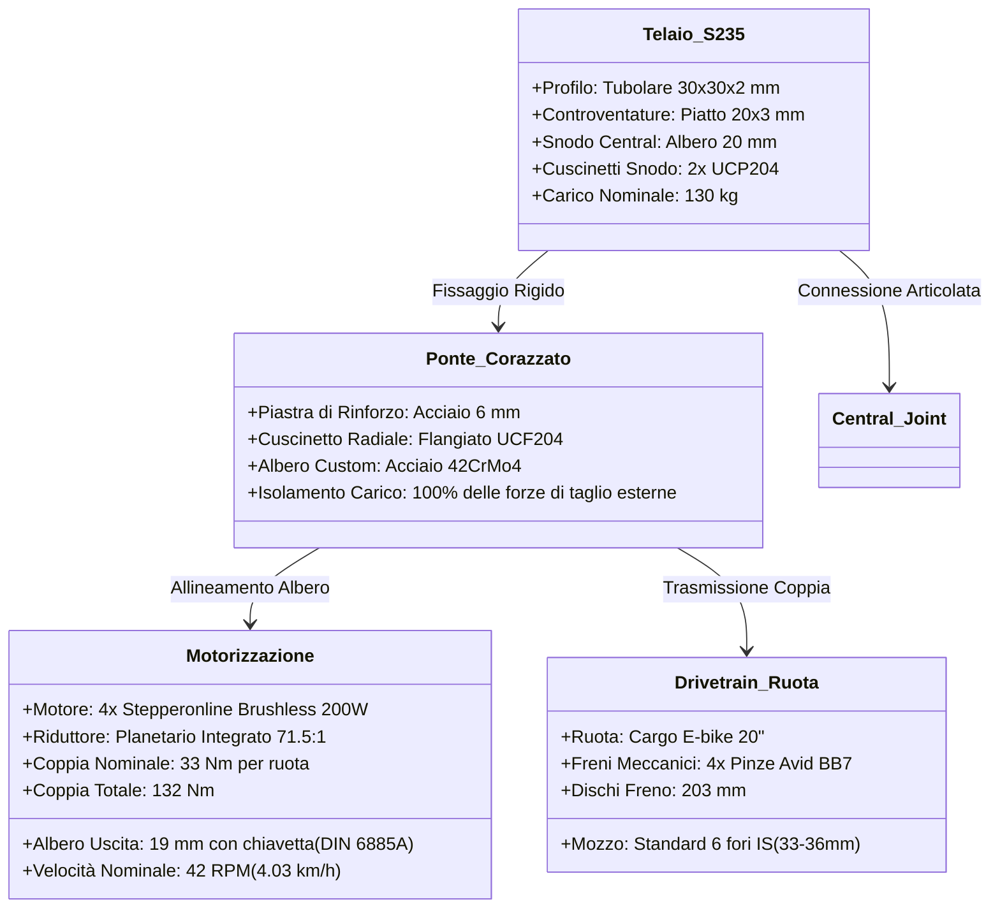

# Specifiche Meccaniche e Strutturali: Axiom Rover "Mulo" - MK0

Questo documento raccoglie, analizza e integra tutti i dati relativi alla struttura, ai motori, ai riduttori e al drivetrain custom del rover da trekking **Axiom Rover "Mulo" - MK0**, giustificando le scelte ingegneristiche in ottica di affidabilità reale e manutenibilità.

Il modello MK0 non va inteso come configurazione "low cost": e' una piattaforma **value-engineered**, cioe' progettata per spendere dove il guadagno tecnico e' reale. Le priorita' sono inseguimento affidabile dell'operatore, carico utile, robustezza strutturale, dissipazione termica, frenata sicura e manutenzione semplice.

---

## 1. Schema Strutturale, Layout Meccanico e Dinamica

Il telaio è progettato secondo una filosofia **articolata 4WD**, composta da due semitelai (anteriore e posteriore) connessi da uno snodo di torsione centrale. Questa architettura garantisce che tutte e 4 le ruote rimangano sempre a contatto con il terreno accidentato, massimizzando la trazione.

> [!TIP]
> **Altezza Pianale e Dinamica Sospensiva (Aggiornamento)**
> A seguito delle valutazioni dinamiche per l'ambiente alpino, l'altezza ottimale di compromesso per il pianale di carico è stata fissata a **55 cm** da terra. Questa altezza garantisce un'ergonomia eccellente per l'operatore mantenendo un angolo di ribaltamento laterale statico sicuro ($\approx 38^\circ$) con un carico di 30 kg e carreggiata di 60 cm. 
> Per mantenere la massima affidabilità a 4 km/h senza compromettere i sensori con le vibrazioni, il telaio adotta una **Micro-Sospensione a Silent-Block**: le piastre dei motori/ruote sono disaccoppiate dal telaio principale tramite tasselli antivibranti M10 in gomma, e lo snodo centrale è smorzato elasticamente. Le gomme da 20" a bassa pressione (1.2 bar) completano l'assorbimento degli urti (Per i calcoli dettagliati, vedi [Analisi Dinamica e Strategia Sospensiva](mulo_mk0_suspension_dynamics.md)).



---

## 2. Analisi Comparativa del Materiale del Telaio: Acciaio S235 vs Alluminio 6061-T6

Per un vero veicolo da trekking off-road sottoposto a sollecitazioni cicliche gravose (urti contro rocce, vibrazioni costanti su pietrisco, carico statico di 130 kg + spinta del verricello), la scelta del materiale è critica.

| Proprietà Ingegneristica | Acciaio S235JR (Scelta Eletta) | Alluminio 6061-T6 | Impatto sul Rover |
| :--- | :--- | :--- | :--- |
| **Limite di Fatica** | **Definito.** Sotto una certa sollecitazione, resiste a infiniti cicli senza rompersi. | **Assente.** Si romperà inevitabilmente per fatica dopo un certo numero di cicli, anche a bassi carichi. | Le vibrazioni costanti del sentiero creano micro-cricche nell'alluminio. L'acciaio dura indefinitamente. |
| **Saldabilità in Officina** | **Eccellente.** Saldabile con elettrodo, MIG o TIG senza alcun pre/post riscaldamento. | **Complessa.** La saldatura riduce la resistenza della giunzione fino al 50% (diventa ricotto 6061-O). | L'alluminio saldato richiede un trattamento termico in un forno industriale a 170°C per recuperare le proprietà (T6), impossibile in un'officina comune. |
| **Riparabilità sul Campo** | **Massima.** Qualsiasi fabbro di montagna o officina di paese può riparare un giunto rotto in 5 minuti. | **Quasi nulla.** Richiede saldatrici AC-TIG specifiche e personale altamente specializzato. | Fondamentale durante trekking remoti. |
| **Modulo Elastico (Rigidezza)** | **~210 GPa.** Molto rigido, flessioni strutturali minime sotto carico. | **~70 GPa.** Tre volte più flessibile dell'acciaio. Richiede spessori maggiori. | L'alluminio tenderebbe a flettere sul giunto di torsione centrale, ovalizzando le sedi dei cuscinetti. |
| **Resistenza a Usura e Sforzo** | **Elevata.** Ideale per bullonatura diretta di cuscinetti pesanti (UCF204). | **Bassa.** I fori filettati tendono a spanarsi se sottoposti a vibrazioni alternate. | I cuscinetti UCP204 dello snodo centrale scaricano forze imponenti direttamente sulle pareti del telaio. |

**Verdetto Ingegneristico:** Il **tubolare d'acciaio S235 da 30x30x2 mm** è la scelta ottimale. L'alluminio comporterebbe rischi inaccettabili di cricche da fatica nelle giunzioni saldate e richiederebbe lavorazioni industriali post-saldatura estremamente costose.

---

## 3. Il "Ponte Corazzato": Dettaglio Tecnico e Drivetrain Custom

I motori elettrici ridotti soffrono enormemente i carichi radiali (il peso del rover che spinge perpendicolarmente sull'albero). Se calettassimo le ruote direttamente sull'albero da 14 mm del riduttore, i cuscinetti interni del motore si distruggerebbero in poche ore di cammino.

Per risolvere questo problema, l'MK0 adotta il **design a "Ponte Corazzato" (Sandwich Layout)**:

```
                  [ TELAIO INTERNO ]          [ TELAIO ESTERNO ]
                          |                           |
   [ Motore ]=======[Piastra Acciaio]==============[Cuscinetto]=======[ Ruota ]
   Stepperonline        da 6 mm                     UCF204            Cargo 20"
   (Supportato)           |                           |               (Carico)
                          |====== Albero Custom ======|
                                Acciaio 42CrMo4
```

### Componenti del Sandwich:
1.  **Motore (Interno):** Stepperonline 24V 200W con riduttore planetario 71.5:1. È imbullonato sul lato interno della piastra di rinforzo da 6 mm. L'albero motore non tocca la ruota direttamente.
2.  **Piastra di Rinforzo (Mezzeria):** Lastra di acciaio S235 da 6 mm di spessore, saldata e imbullonata direttamente al tubolare 30x30 del telaio. Funge da barriera strutturale.
3.  **Cuscinetto UCF204 (Esterno):** Cuscinetto flangiato autoallineante a 4 fori, imbullonato sul lato esterno della piastra da 6 mm. Sopporta il 100% delle forze radiali e flettenti esercitate dalla ruota.
4.  **Albero Custom di Prolunga (Materiale: Acciaio bonificato 42CrMo4):**
    *   *Lato Motore:* Foro cieco da 19 mm rettificato con cava chiavetta (DIN 6885A) per accoppiarsi all'uscita del riduttore.
    *   *Sezione Centrale:* Diametro 20 mm a tolleranza ristretta `h6` per alloggiare perfettamente nella pista interna del cuscinetto UCF204.
    *   *Lato Ruota:* Flangia circolare integrata per l'accoppiamento con il mozzo a 6 fori standard ISO della ruota Cargo da 20".

*Risultato:* Le forze d'urto del terreno vengono trasferite dalla ruota all'albero custom, da questo al cuscinetto UCF204, e infine scaricate direttamente sul telaio in acciaio. **Il riduttore del motore riceve solo e soltanto la coppia pura di torsione**, azzerando il rischio di rotture meccaniche interne.

*   **Manutenibilità e Sblocco d'Emergenza (Limp-Home meccanico):** Il principale capolavoro ingegneristico di questo layout risiede nella separazione fisica tra il supporto della ruota (esterno) e il motore (interno). Se un riduttore planetario dovesse subire un catastrofico blocco meccanico interno (es. rottura dei satelliti o grippaggio degli ingranaggi), nei sistemi tradizionali a calettamento diretto la ruota rimarrebbe completamente bloccata, rendendo impossibile il traino. Nel Mulo, è sufficiente svitare i 4 bulloni flangiati del motore dal lato *interno* del telaio e sfilare il motore verso l'interno dello chassis. L'albero motore si scollega dall'albero custom e la ruota, supportata autonomamente dal cuscinetto esterno UCF204, **rimane saldamente in sede e diventa istantaneamente folle al 100%**, permettendo al rover di essere trainato o di continuare la marcia su 3 ruote con attrito nullo.

### 3.1 Protocollo Operativo di Decoupling sul Campo (Limp-Home Manuale)

In caso di guasto meccanico irreversibile a uno dei motori o riduttori durante un trekking, l'operatore può eseguire l'isolamento fisico dell'asse danneggiato in meno di 2 minuti seguendo questa procedura:

1.  **Messa in Sicurezza ed E-Stop:** Arrestare il rover premendo il fungo di emergenza (E-stop) o spegnendo l'interruttore generale del bus DC per togliere tensione a tutti i driver VESC.
2.  **Isolamento Elettrico:** Scollegare il connettore rapido stagno IP68 (cavi di fase + sensori di Hall) del motore guasto. Questo protegge l'elettronica da eventuali correnti indotte (effetto dinamo) se il motore dovesse girare a vuoto durante il traino manuale prima dello smontaggio completo.
3.  **Rimozione Viti di Fissaggio:** Utilizzando una singola chiave esagonale maschio da 5 mm (inclusa nel kit attrezzi di bordo del Mulo), svitare le **4x viti a brugola M6** che flangiano la carcassa del riduttore planetario al lato interno della piastra in acciaio da 6 mm.
4.  **Sfilamento del Motore:** Tirare delicatamente il corpo motore verso l'interno dello chassis. L'albero di uscita da 14 mm del riduttore sfilerà agevolmente dalla sede femmina dell'albero custom in 42CrMo4, lasciando libera la chiavetta DIN 6885A.
5.  **Stoccaggio di Sicurezza:** Riporre il motore danneggiato nel vano bagagli centrale del rover o, se non è possibile, assicurarlo provvisoriamente al telaio tubolare tramite due fascette riutilizzabili in velcro ad alta resistenza per evitare che penda o si danneggi.
6.  **Ripristino Funzionalità:** Riattivare l'interruttore generale. Il firmware rileverà l'assenza del VESC escluso e passerà automaticamente alla modalità di guida degradata (3WD).

### 3.2 Gestione Software della Trazione Asimmetrica (3WD Degraded Mode)

La perdita di una ruota motrice introduce una forte asimmetria nella dinamica del veicolo. Se i tre motori superstiti continuassero a erogare coppia in modo simmetrico, il rover devierebbe inesorabilmente verso il lato della ruota folle (effetto imbardata parassita). Per compensare questo fenomeno, il firmware dell'ESP32-S3 implementa una logica di controllo dedicata:

```
                  [ RUOTA INTEGRATA ]          [ RUOTA INTEGRATA ]
                     (Trazione: 100%)             (Trazione: 100%)
                            \                             /
                             \                           /
                              +--- [ TELAIO ARTICOLATO ] +
                             /                           \
                            /                             \
                 [ RUOTA FOLLE (GUASTA) ]      [ RUOTA INTEGRATA ]
                     (Trazione: 0%)               (Trazione: Compensata)
```

1.  **Rilevamento e Diagnostica del Guasto:**
    *   Il VESC associato al motore guasto smette di comunicare sul bus CAN (generando un timeout) oppure invia un frame di fault persistente (es. `FAULT_CODE_DRV_8302`, `FAULT_CODE_OVER_CURRENT` o `FAULT_CODE_SENSORLESS_STALL`).
    *   L'ESP32-S3 transisce immediatamente lo stato globale a `DEGRADED`, limitando la velocità massima di avanzamento a **v_max = 1.5 km/h** (0.42 m/s) e la corrente massima erogabile dai motori al 50% del valore nominale per evitare surriscaldamenti.
2.  **Compensazione Attiva dell'Imbardata (Active Yaw Control):**
    *   Il firmware acquisisce ad alta frequenza (100 Hz) la velocità angolare di imbardata `ω_z` (yaw rate) dall'IMU di bordo (BNO085).
    *   Viene calcolato l'errore tra l'imbardata reale e quella richiesta dal comando di sterzo dell'operatore: `e_yaw = ω_z_target - ω_z_real`.
    *   Un regolatore PID dedicato genera un offset di coppia correttivo `ΔT`. Questa coppia di compensazione viene sommata al motore singolo sul lato "danneggiato" e sottratta (o invertita) sui due motori del lato "sano" per generare un momento contro-imbardata che stabilizza la traiettoria rettilinea.
    *   *Limitatore Anti-Slittamento:* Se la ruota singola superstite del lato danneggiato inizia a slittare a causa del sovraccarico, il controllo di trazione (TCS) riduce istantaneamente la coppia prima che si perda stabilità direzionale.
3.  **Comportamento in Curva:**
    *   La sterzata skid-steer con sole 3 ruote motrici è asimmetrica. Il raggio di curvatura minimo verso il lato danneggiato sarà maggiore rispetto a quello verso il lato sano. Il firmware adatta dinamicamente i coefficienti di miscelazione (mixing rate) tra sterzo e trazione per garantire una risposta fluida e prevedibile ai comandi dell'operatore.

---

## 4. Dati di Trazione e Calcoli Prestazionali

I dati raccolti sui motori **Stepperonline 24V 200W (con riduttore planetario 71.5:1)** rivelano prestazioni ideali per l'off-road pesante:

*   **Velocità Nominale all'albero ridotto:** **42 RPM**
*   **Velocità di Avanzamento:** Con ruote Fat-bike da 20" (diametro effettivo circa D = 0.51 m):
    
    v = RPM × π × D × (60 / 1000) ≈ 42 × 3.1416 × 0.51 × 0.06 ≈ 4.03 km/h
    
    Questa velocità coincide perfettamente con la **velocità naturale del passo umano** (trekking a piedi su sentiero).
*   **Coppia Nominale Continuativa:** **33 Nm** per singola ruota.
*   **Coppia Totale (4WD):** **132 Nm** totali scaricati a terra.
*   **Forza di Spinta Lineare Totale (Fs):**
    
    Fs = Coppia Totale / Raggio Ruota = 132 Nm / 0.255 m ≈ 517.6 N ≈ 53 kg di spinta netta.
    
    *Nota:* Una spinta lineare di oltre 500 N consente al rover di 130 kg di arrampicarsi su pendenze superiori al **35% (circa 20°)** su terreno a bassa aderenza, spingendosi ben oltre il requisito nominale del 15%.

---

## 5. Dimensionamento Termico e Dissipazione

La prestazione reale del rover non dipende solo dalla coppia nominale: in trekking il caso critico e' spesso **bassa velocita' + alta coppia + poca ventilazione**, oppure discesa lunga con rigenerazione limitata. Il dimensionamento MK0 deve quindi prevedere margine termico fin dall'inizio.

### Componenti da Sovradimensionare

1.  **Controller VESC:** scegliere modelli con corrente continua realmente compatibile con il carico, non solo corrente di picco. Montarli su dissipatore metallico collegato al telaio, con sensore temperatura e spazio per ventilazione protetta.
2.  **Motori e Riduttori:** verificare temperatura carcassa durante salita lenta a pieno carico. Se superano soglie conservative, introdurre derating automatico e rapporti/ruote coerenti con il passo umano.
3.  **Batteria e BMS:** il pacco batteria deve supportare corrente continua, picchi di trazione e rigenerazione. Il BMS deve misurare temperatura celle e poter interrompere il sistema in modo prevedibile.
4.  **Dump Load:** la resistenza di frenatura va montata su supporto dissipante, lontano da plastica, cablaggi e pacco batteria. Deve essere dimensionata per discese prolungate con batteria gia' carica.
5.  **Cablaggio di Potenza:** sezioni cavo, capicorda, fusibili e connettori devono essere scelti per corrente continua e vibrazioni, non per test statici da banco.

### Logica di Protezione Consigliata

- Derating progressivo sopra la temperatura nominale di VESC, motori o batteria.
- Arresto controllato su sovratemperatura critica, sovracorrente persistente o perdita comunicazione CAN.
- Logging di corrente, tensione, temperatura e fault VESC per manutenzione predittiva.
- Test termico obbligatorio con carico reale, salita lenta, discesa rigenerativa e stop-and-go su terreno irregolare.

---

## 6. Sistema Frenante di Sicurezza

Un rover pesante 130 kg operante in discesa di montagna non può affidarsi solo alla frenata elettrica. In caso di mancanza di alimentazione, il rover deve arrestarsi e bloccarsi autonomamente.

1.  **Frenata Elettrica Dinamica:** Gestita dai driver VESC tramite frenata rigenerativa. L'energia generata viene scaricata sulla batteria o dissipata in calore su una resistenza di frenatura (**Dump Load**) per evitare sovratensioni sui driver quando la batteria è carica al 100%.
2.  **Frenata Meccanica di Stazionamento e Sicurezza:**
    *   **Attuatori:** 4x Dischi freno da **203 mm** montati direttamente sulle flange degli alberi ruota custom.
    *   **Pinze:** Pinze meccaniche a doppio pistone **Avid BB7 MTN** (famose per l'affidabilità estrema in MTB e la facilità di regolazione senza attrezzi).
    *   **Controllo:** Sistema a cavo metallico (Bowden) collegato a leve manuali dotate di cricchetto di bloccaggio (pulsante di stazionamento, stile freno a mano motociclistico). Il rover può essere bloccato in sicurezza su qualsiasi pendenza, anche a batteria totalmente scarica.

---

## 7. Architettura Ibrida in Serie (Range Extender)

Per consentire trekking di lunga durata in scenari montani isolati, superando i limiti di peso e autonomia delle sole batterie al litio, l'Axiom MK0 integra un sistema **Range Extender ibrido in serie**.

### Specifiche Tecniche del Gruppo Elettrogeno
*   **Tipo:** Generatore compatto a benzina con tecnologia Inverter.
*   **Peso:** 12 kg (a secco).
*   **Potenza Costante:** 1000 W (alimentazione continua a 230V AC).
*   **Potenza di Picco:** 1200 W (durata massima 10 secondi).
*   **Rumorosità:** circa 52-58 dB a 7 metri (silenzioso, ideale per rispetto dell'ambiente naturale).

### Configurazione Elettrica in Parallelo (Bus DC)
Il generatore a benzina non muove meccanicamente il rover. L'intera propulsione rimane elettrica (4x motori brushless + VESC). Il generatore alimenta direttamente il sistema tramite un'architettura in parallelo con la batteria primaria (funzione "tampone"):

```
[ GENERATORE INVERTER 1000W ]
             |
          (230V AC)
             v
[ CARICABATTERIE CC/CV (600-800W) ]
             |
        (Corrente DC)
             v
 [ DIODO DI BLOCCO (IDEALE) ]
             |
             +--------------------> [ BUS DC PRINCIPALE ] <----> [ BATTERIA TAMPONE LIPO ]
                                             |
                                             v
                                  [ 4x DRIVER MOTOR VESC ]
```

*   **Caricabatterie CC/CV:** Collegato alla presa 230V AC del generatore, converte l'energia in corrente continua alla tensione nominale del pacco batteria (es. 24V o 48V).
*   **Diodo di Blocco (Diodo Ideale):** Posizionato sulla linea di ricarica in serie per impedire il riflusso di corrente dalla batteria verso il caricabatterie quando il generatore è spento.
*   **Ripartizione Dinamica dei Flussi di Potenza:**
    *   *Carico Basso (Avanzamento in piano / Stazionamento):* Il generatore produce 600W. Se i motori consumano solo 200W, i restanti 400W fluiscono automaticamente nella batteria per ricaricarla.
    *   *Carico Elevato (Salita / Ostacoli):* I motori richiedono picchi di 1500W. Il generatore fornisce i suoi 1000W costanti direttamente alla linea di potenza dei VESC, mentre la batteria tampone fornisce i restanti 500W scaricandosi lentamente.

### Integrazione Meccanica e Protezione dalle Vibrazioni
*   **Posizionamento:** Montato sul semitelaio posteriore. Il peso di 12 kg funge da contrappeso per l'assale anteriore (bilanciando il verricello e la suite ToF) e mantiene stabile l'assetto longitudinale.
*   **Antivibranti (Silent-Block):** Per evitare che le vibrazioni ad alta frequenza del motore a scoppio compromettano le letture dei sensori inerziali (IMU), il generatore è isolato tramite **4x piedini ammortizzanti in gomma morbida (durezza Shore A 45)**. La scatola dell'elettronica principale è a sua volta montata su boccole di isolamento in neoprene.

---

## 8. Analisi dei Pesi Reali e Soluzioni per il Trasporto

Per pianificare correttamente la logistica dell'Axiom Rover "Mulo", abbiamo effettuato un calcolo analitico preciso della massa dei singoli componenti strutturali, meccanici ed elettrici (basandoci sulle dimensioni dei tubolari S235, delle piastre da 6 mm, degli alberi in 42CrMo4 e dei componenti commerciali selezionati).

### 8.1 Distinta dei Pesi Reali (Weight Breakdown)

1.  **Carpenteria e Telaio S235:**
    *   Tubolari 30x30x2 mm (sviluppo totale 5.0 metri × 1.76 kg/m): **8.79 kg**
    *   Controventature diagonali (piatto 20x3 mm, 2.8 metri × 0.47 kg/m): **1.32 kg**
    *   Piastre di rinforzo da 6 mm (4x piastre ruote + 2x piastre snodo): **4.13 kg**
2.  **Organi di Trasmissione e Cuscinetti:**
    *   Cuscinetti commerciali (4x UCF204 flangiati + 2x UCP204 snodo centrale): **3.80 kg**
    *   Alberi custom in acciaio bonificato 42CrMo4 (4x mozzi ruota + albero snodo): **3.11 kg**
3.  **Propulsione ed Attuazione:**
    *   Motori e riduttori (4x Stepperonline M82B200-24P-30S/G82-71.5S1 da 4.93 kg cad.): **19.72 kg**
    *   Ruote Cargo 20" complete (4x cerchio, raggi, mozzo, camera e pneumatico 20x3.0"): **13.40 kg**
4.  **Alimentazione ed Elettronica (Comuni):**
    *   Impianto frenante di sicurezza (4x pinze Avid BB7, dischi 203mm, cavi): **1.20 kg**
    *   Cervello elettronico (Jetson, STM32, 4x VESC, box IP65, sensori e cablaggi): **5.30 kg**
    *   Verricello elettrico custom completo (motore StepperOnline ridotto, cuscinetti UCF204, tamburo, perno di blocco, cavo Dyneema): **9.28 kg**
5.  **Masse Risultanti Finali per Configurazione (Simmetria di Peso):**
    *   **Configurazione A: Ibrido Seriale (Range Extender a benzina)**
        *   Batteria LiFePO4 24V 30Ah (720 Wh) + Box + BMS: **8.70 kg**
        *   Sotto-sistema Range Extender (Generatore 1000W dry 12.00 kg + 2 litri carburante 1.48 kg + staffe/silent-blocks 1.20 kg): **14.68 kg**
        *   **MASSA TOTALE ROVER IBRIDO PRONTO ALL'USO:** **95.06 kg**
    *   **Configurazione B: 100% Elettrico (Batteria High-Capacity)**
        *   Batteria LiFePO4 24V 100Ah (2560 Wh) + Box rinforzato + BMS: **23.00 kg**
        *   Sotto-sistema Range Extender: **ASSENTE (0.00 kg)**
        *   **MASSA TOTALE ROVER 100% ELETTRICO PRONTO ALL'USO:** **94.68 kg**

*Nota di Simmetria Ingegneristica:* Le due configurazioni pesano virtualmente lo stesso (differenza di soli 0.38 kg), permettendo all'operatore di scegliere tra l'autonomia infinita a benzina o il silenzio assoluto del 100% elettrico senza alcuna variazione di peso sul telaio.

---

### 8.2 Valutazione Critica del Trasporto sul Tettuccio dell'Auto

L'idea di trasportare il Mulo sul tettuccio dell'auto tramite barre portatutto tradizionali presenta gravi criticità ingegneristiche, ergonomiche e di sicurezza:

1.  **Limiti di Carico Dinamico dell'Auto:** La stragrande maggioranza delle vetture stradali ha un limite massimo di carico dinamico sul tetto (dichiarato dal costruttore per le barre portatutto) compreso tra **50 kg e 75 kg**. Un carico di 87.98 kg (ibrido) o 87.60 kg (elettrico) supera ampiamente questo limite di sicurezza. Durante manovre d'emergenza (frenate brusche o bruschi cambi di direzione), le forze d'inerzia esercitate sul tetto potrebbero deformare i montanti dell'auto o strappare i piedi di fissaggio delle barre.
2.  **Rischi Ergonomici e di Infortunio:** Sollevare manualmente un blocco rigido e ingombrante da oltre 87 kg ad un'altezza superiore a 1.50 metri (sopra la testa) è proibitivo e pericoloso per la salute della schiena. Il rischio di infortuni muscolari, perdita di equilibrio o scivolamento del veicolo sulle lamiere dell'auto (danneggiando carrozzeria e sensori delicati come LiDAR e telecamere) è inaccettabilmente alto.

*   **Verdetto Ingegneristico:** **La soluzione del trasporto sul tettuccio dell'auto è completamente bocciata.** Il rover deve essere movimentato tramite il sistema smontabile Quick-Split, rampe con verricello o gancio traino.

---

### 8.3 Soluzioni Approvate per la Logistica e il Trasporto

Per risolvere in sicurezza il problema del trasporto, l'architettura del Mulo MK0 integra due funzionalità native e supporta un'opzione esterna standard:

#### 1. Soluzione A: Telaio a Sgancio Rapido "Quick-Split" (Smontabilità in 2 Minuti)
Lo snodo di torsione centrale è progettato per consentire la rapida separazione fisica dei due semitelai (anteriore e posteriore):
*   **Meccanica:** L'albero di torsione da 20 mm che unisce i due semitelai è bloccato in sede da un perno passante di sicurezza con **coppiglia a scatto rapido (pull-pin)**. Rimuovendo la coppiglia, l'albero sfila agevolmente dai cuscinetti UCP204.
*   **Elettronica:** Il cablaggio passante tra i due semitelai (alimentazione del bus DC principale e bus CAN per i segnali) è interrotto da due connettori rapidi stagni **IP68 a baionetta di derivazione militare (es. serie Amphenol o connettori Anderson di potenza)**.
*   **Pesi risultanti:** Il rover viene diviso in due moduli indipendenti:
    *   *Modulo Anteriore:* **36.4 kg** (comprensivo di ruote anteriori, piastre, verricello, sterzo e suite sensori).
    *   *Modulo Posteriore:* **36.9 kg** (senza Range Extender, con batteria 30Ah) o **51.6 kg** (con Range Extender montato e batteria 30Ah). Nel caso di configurazione 100% elettrica con batteria da 100Ah, il modulo posteriore pesa **51.2 kg** (con la batteria montata nel suo alloggiamento).
    Un peso di circa 36 kg per modulo è movimentabile in sicurezza da una singola persona per caricarlo nel bagagliaio dell'auto, eliminando la necessità di sforzi eccessivi.

#### 2. Soluzione B: Auto-Caricamento con Rampe e Verricello (Zero Sforzo Fisico)
Se si desidera trasportare il rover intero all'interno di un SUV, Station Wagon o furgone senza smontarlo:
*   **Attrezzatura:** Si utilizzano **2x rampe pieghevoli leggere in alluminio** (stile rampa per moto/ATV, dal peso complessivo di 4 kg e lunghezza 1.8 metri, facilmente riponibili a lato del bagagliaio).
*   **Procedura:**
    1.  Si posizionano le rampe sul bordo del paraurti posteriore dell'auto.
    2.  Si aggancia il cavo del verricello elettrico anteriore (`rover_winch`) ad un anello di traino fisso all'interno del bagagliaio.
    3.  L'operatore, tramite radiocomando o pulsantiera, aziona il verricello. Il rover **si tira da solo su per le rampe** entrando dolcemente nel bagagliaio.
*   **Sforzo fisico richiesto:** **Zero.** Il lavoro meccanico di sollevamento è interamente svolto dal verricello a 12V alimentato dalla batteria del rover.

#### 3. Soluzione C: Porta-Moto da Gancio Traino (Trasporto Esterno Professionale)
Per chi dispone di un gancio di traino omologato sull'automobile:
*   **Struttura:** Si adotta un porta-moto leggero da gancio traino (omologato per carichi verticali fino a 120-150 kg).
*   **Vantaggi:** Il rover viene caricato intero sul supporto esterno a soli 30-40 cm da terra (sforzo di sollevamento minimo o agevolato da una piccola rampa laterale). Il bagagliaio rimane libero per l'attrezzatura da trekking e non c'è rischio di sporcare l'abitacolo con fango o residui di terra raccolti dalle ruote Fat del Mulo durante le escursioni.

---

## 9. Vano Ricambi, Attrezzi e Kit di Manutenzione Straordinaria sul Campo

In scenari di trekking remoto e autonomo, la possibilità di effettuare riparazioni e manutenzione straordinaria direttamente sul campo è un requisito critico progettuale. L'Axiom MK0 integra un **vano sottopianole dedicato** per lo stoccaggio di pezzi di ricambio, attrezzi e materiali di emergenza, progettato per rendere il rover autonomo da assistenza esterna anche in caso di guasti gravi.

### 9.1 Posizionamento e Integrazione Strutturale

Il vano ricambi è posizionato **sotto il piano di carico (pianale)**, tra i due semitelai, nello spazio normalmente inutilizzato tra la batteria e la struttura tubolare inferiore. Questa collocazione offre vantaggi multipli:

*   **Centro di Gravità:** Il peso degli attrezzi e dei ricambi (stimato 5-8 kg a pieno carico) è posizionato il più basso possibile, contribuendo favorevolmente alla stabilità longitudinale e laterale del rover.
*   **Protezione Naturale:** Il vano è protetto dall'alto dal pianale di carico e lateralmente dal telaio tubolare S235. Il fondo è chiuso da una piastra in alluminio anticorrosione con fori di drenaggio per acqua e fango.
*   **Accessibilità:** Un coperchio basculante a scatto rapido (stile valigia) consente l'apertura dal lato esterno del rover senza dover scaricare il carico dal pianale superiore.

### 9.2 Contenuto Standard del Kit di Manutenzione da Campo

Il kit è organizzato in **scomparti modulari con inserti in schiuma EVA tagliata a misura** per impedire il movimento degli attrezzi durante la marcia e garantire un riscontro tattile immediato della mancanza di un componente:

#### A. Attrezzi Generali
| Attrezzo | Specifica | Quantità | Motivazione |
|:---|:---|:---|:---|
| Chiavi esagonali maschio (Brugola) | Serie completa M4 – M8, lunghezza 150mm | 1 set (8 pezzi) | Sblocco motori (M6), cuscinetti, piastrine |
| Chiavi a pipa组合 | 8mm – 19mm (doppia estremità) | 1 set (6 pezzi) | Bulloneria M8 telaio, ruote, snodo centrale |
| Chiave dinamometrica | Range 10-50 Nm, passo 0.5 Nm | 1 | Serraggio preciso bulloni ruota e motore |
| Cacciavite Phillips e piatto | Lunga 200mm, punte intercambiabili | 1 | Regolazione pinze freno, fascette, coperture |
| Tronchese / Pinze tagliafili | Apertura 160mm | 1 | Taglio cavi, fascette, emergenze elettriche |
| Pinza a becco lungo | Apertura 180mm | 1 | Recupero viti cadute, manipolazione connettori |
| Muletto per pneumatici | 12V compressore + manometro | 1 | Gonfiatura pneumatici 1.2 bar, riparazione forature |

#### B. Ricambi Critici
| Componente | Specifica | Quantità | Peso Unitario | Peso Totale |
|:---|:---|:---|:---|:---|
| VESC di ricambio | VESC 6 MkVI o equivalente | 1 | 0.35 kg | 0.35 kg |
| Fusibili di riserva | Serie 30A (stessa portata di linea) | 5 | 0.01 kg | 0.05 kg |
| Connettori IP68 di riserva | Anderson SB50 + Amphenol IP68 | 2 set | 0.15 kg | 0.30 kg |
| Camera di ricambio | 20x3.0" Butyl (compatibile con 20" Cargo) | 1 | 0.25 kg | 0.25 kg |
| Pezze per foratura | Kit patch vulcanizzante universale | 1 | 0.10 kg | 0.10 kg |
| Bulloneria di riserva | M6x20 + M8x25 (Classe 8.8, Nyloc) | 10+10 | - | 0.20 kg |
| Chiavetta DIN 6885A | 6x6x25mm (per albero custom) | 2 | 0.02 kg | 0.04 kg |
| Fascette riutilizzabili in velcro | Lunghezza 300mm, resistenza 50 kg | 10 | 0.01 kg | 0.10 kg |

#### C. Materiali di Emergenza
| Materiale | Specifica | Quantità | Peso |
|:---|:---|:---|:---|
| Nastro isolante arancione | Larghezza 25mm, alta temperatura | 1 rotolo | 0.15 kg |
| Stucco epossidico bicomponente | Tipo JB Weld, tempo working 4 min | 2 bustine | 0.10 kg |
| Lubrificante multiplo in spray | Latta 100ml con applicatore a straws | 1 | 0.12 kg |
| Guanti da lavoro antitaglio | Taglia universale | 2 paia | 0.10 kg |

### 9.3 Peso Complessivo del Kit

| Categoria | Peso Stimato |
|:---|:---|
| Attrezzi generali | ~3.8 kg |
| Ricambi critici | ~1.4 kg |
| Materiali di emergenza | ~0.5 kg |
| **TOTALE KIT MANUTENZIONE** | **~5.7 kg** |

### 9.4 Specifiche del Vano e Accessori

*   **Materiale Scatola:** Alluminio 5083-H321 (anticorrosione marina, spessore 2mm), saldata TIG, sigillata con guarnizione in silicone fluoroelastomero.
*   **Dimensioni Interne:** 400 × 300 × 120 mm (circa 14.4 litri).
*   **Peso della Scatola Vuota:** ~1.8 kg.
*   **Sistema di Fissaggio:** 4 bulloni M8 a sgancio rapido a leva (tipo Dzus o equivalenti), permettendo il montaggio/smontaggio senza attrezzi in meno di 30 secondi.
*   **Tenuta all'Acqua:** Classificazione IP67 con coperchio chiuso, grazie a guarnizione a labirinto e scarichi di condensa sul fondo.
*   **Antivibrante:** Il vano è isolato dal telaio tramite 4 silent-block in neoprene da 10 mm per proteggere i componenti elettronici di ricambio (VESC) dalle vibrazioni stradali.

### 9.5 Logica Operativa di Manutenzione sul Campo

1.  **Manutenzione Ordinaria (preventiva):** Durante le soste, l'operatore può gonfiare le ruote, regolare le pinze freno e verificare i fissaggi con la chiave dinamometrica. Tutti gli attrezzi necessari sono accessibili in meno di 60 secondi.
2.  **Riparazione di Emergenza (guasto motori):** In caso di blocco motore, si esegue la procedura di decoupling descritta alla Sezione 3.1 (Limp-Home Manuale) utilizzando la chiave esagonale M5 dal kit. Il motore guasto viene stoccato nel vano ricambi (se dimensioni lo permettono) o assicurato al telaio con fascette velcro.
3.  **Sostituzione VESC:** Se un driver VESC entra in fault permanente, viene scollegato e sostituito con il VESC di riserva dal kit. Il collegamento è plug-and-play grazie ai connettori rapidi IP68.
4.  **Riparazione Foratura:** In caso di foratura della camera, il kit contiene pezze vulcanizzanti e il muletto per gonfiare d'emergenza fino al ritorno in base.
5.  **Riparazione Strutturale Minore:** Lo stucco epossidico bicomponente consente di tamponare crepe o piccole fratture su piastre di rinforzo o componenti non portanti fino al ritorno in officina per saldatura definitiva.

> [!NOTE]
> **Aggiornamento Periodico del Kit:** Prima di ogni trekking pianificato, è obbligatorio verificare la completezza e la scadenza dei materiali del kit (soprattutto lo stucco epossidico e le guanti). Un elenco di controllo (checklist) deve essere incluso nella documentazione operativa del rover.

---

## 10. Sistema di Alimentazione Avanzato (LiFePO4 100Ah) e Sotto-sistema di Ricarica AC/DC

Per massimizzare l'autonomia silenziosa del rover da trekking "Mulo" (Configurazione B), viene integrato un pacco batteria LiFePO4 ad alta capacità accoppiato a una suite di ricarica flessibile ed efficiente in grado di operare sia in rifugio (220V AC) sia presso le colonnine di ricarica e-bike montane.

### 10.1 La Batteria: LiFePO4 24V 100Ah
La batteria selezionata è un pacco commerciale LiFePO4 da **24V nominali (25.6V effettivi, architettura 8S)** con capacità di **100Ah (2560 Wh / 2.56 kWh)**.

#### Specifiche Principali e Analisi Costi (Mercato 2026):
*   **Capacità Energetica:** 2.56 kWh.
*   **Dimensioni Tipiche:** circa 520 × 240 × 220 mm (Layout compatto, alloggiabile nel pianale posteriore).
*   **Peso:** 20.0 kg (celle + BMS interno) + 3.0 kg (case metallico protettivo stagno IP67 con guide di fissaggio antivibranti).
*   **BMS Integrato:** Corrente di scarica continuativa di **100A** (potenza continuativa gestibile: 2560W, ideale per coprire i picchi di stallo dei 4 motori da 200W, pari a max ~1500W complessivi).
*   **Fasce di Costo sul Mercato:**
    *   *Fascia Budget (es. Eco-Worthy, Redodo, LiTime base):* **350 € – 450 €**. Celle prismatiche Grade A, molto affidabili dal punto di vista elettromeccanico, ma prive di connettività e riscaldamento.
    *   *Fascia Media "Smart" (Consigliata - es. LiTime Smart con Bluetooth e Auto-Riscaldamento):* **450 € – 650 €**. Include:
        - **Modulo Bluetooth + App Mobile:** Consente di monitorare in tempo reale lo stato di carica (SoC), la tensione delle singole celle e la temperatura della batteria direttamente dallo smartphone o integrando un dongle sulla Jetson.
        - **Auto-riscaldamento integrato:** In ambiente montano, la temperatura può scendere sotto i 0°C. Caricare una batteria al litio sotto il punto di congelamento distrugge permanentemente le celle per deposizione di litio metallico. Il sistema di riscaldamento interno consuma una frazione dell'energia di ricarica per portare le celle sopra i 5°C prima di avviare la ricarica reale.
    *   *Fascia Premium (es. Victron Energy Smart, Mastervolt):* **900 € – 1500 €+**. Massima robustezza industriale, connettività bus nativa (VE.Can / RS485) per telemetria integrata diretta in ROS 2, ma economicamente meno sostenibile.

### 10.2 Architettura di Ricarica Duale (AC 220V & DC Colonnine E-bike)
Il rover deve potersi ricaricare rapidamente in qualsiasi scenario montano. L'architettura prevede due ingressi di ricarica indipendenti collegati in parallelo sul Bus DC della batteria tramite diodi di blocco (diodi ideali):

```
                                          +---------------------------------------+
                                          |            ROVER "MULO"               |
                                          |                                       |
  [ PRESA 220V AC (RIFUGIO) ] ----------> [ CARICATORE AC-DC (Mean Well NPB-750) ] |
  (Presa Neutrik powerCON TRUE1)          |   (24V 22.5A / ~650W)                 |
                                          |          |                            |
                                          |    [ Diodo Ideale 1 ]                 |
                                          |          v                            |
  [ COLONNINA E-BIKE (PORTA DC) ] ------> [ CARICATORE DC-DC (MPPT SmartSolar)   ] | ---> [ BUS DC / BATTERIA 24V 100Ah ]
  (36V/48V DC, Rosenberger RoPD)          |   (Ingresso 30-60V -> Uscita 29.2V)   |
                                          |          |                            |
                                          |    [ Diodo Ideale 2 ]                 |
                                          |          v                            |
                                          +---------------------------------------+
```

```text
       SCHEMA DI CABLAGGIO DETTAGLIATO - SOTTO-SISTEMA DI RICARICA DUALE
       =================================================================

   [ PRESA ESTERNA AC IP68 ] (Neutrik powerCON TRUE1 TOP)
   PIN L (Linea)   --------> [ Cavo Marrone 3x1.5mm² ] -------> Ingresso AC (L) [ Mean Well NPB-750-24 ]
   PIN N (Neutro)  --------> [ Cavo Blu 3x1.5mm² ] ----------> Ingresso AC (N) [ (Caricatore AC-DC) ]
   PIN PE (Terra)  --------> [ Cavo Giallo/Verde 1.5mm² ] ----> Ingresso AC (PE)
                                    |
            [ PRESA ESTERNA DC IP69K ] (Rosenberger RoPD Magnetico - Colonnine E-bike)
    PIN + (Positivo) -------> [ Cavo AWG 10 Rosso (Silicone) ] -+
    PIN - (Negativo) -------> [ Cavo AWG 10 Nero (Silicone) ]  -+--> [ INGRESSO PV (+) ] [ Victron SmartSolar ]
                                                                |--> [ INGRESSO PV (-) ] [ MPPT 75/15 ]
    [ PRESA ESTERNA SOLAR ] (MC4 Stagna IP68 - Pannello Solare) |
    PIN + (Positivo) -------> [ Cavo AWG 10 Rosso (Silicone) ] -+
    PIN - (Negativo) -------> [ Cavo AWG 10 Nero (Silicone) ]  -+
    
    PIN Data/CAN (Opt.) ----> [ Cavo 4 poli schermato ] --------> Interfaccia VE.Direct -> [ Optoisolatore 6N137 ]
                                                                                                 |
                                                                                                 v
                                                                                            [ ESP32-S3 RX/TX ]

   [ CONNESSIONI DI POTENZA DC VERSO BATTERIA (AWG 10 SILICONE) ]
   
   Mean Well (+) --------> [ Fusibile Stagno 30A ] -------> Ingresso IN (+)  [ Diodo Ideale 1 ]
   Mean Well (-) -----------------------------------------> Ingresso GND (-) [ (MOSFET 80V 50A) ]
                                                                   |
                                                                   v
                                                             Uscita OUT (+) ----+
                                                                                |
   Victron OUT (+) ------> [ Fusibile Stagno 30A ] -------> Ingresso IN (+)     | ---> [ BARRA COLLETTRICE DC (+) ]
   Victron OUT (-) ---------------------------------------> Ingresso GND (-)    |            |
                                                                   |            |            v
                                                                   v            |      [ BMS BATTERIA (+) ]
                                                             Uscita OUT (+) ----+
   
   Mean Well (-) --------------------------------------------------------------------> [ BARRA COLLETTRICE DC (-) ]
   Victron OUT (-) ------------------------------------------------------------------>            |
                                                                                                  v
                                                                                       [ BMS BATTERIA (P-) ]
```


#### 1. Ricarica da Presa 220V AC (Rifugi e Baita)
*   **Hardware Eletto:** Alimentatore/Caricabatterie intelligente **Mean Well NPB-750-24** (750W nominali, programmabile).
*   **Caratteristiche & Dissipazione:**
    - Il Mean Well NPB-750 è programmabile tramite protocollo CAN, è fanless (convezione robusta naturale) ed eroga fino a **22.5A** di corrente a 29.2V (tensione di fine carica per LiFePO4 8S).
    - Consente di ripristinare il **65% della carica in sole 3 ore** (ideale per una pausa pranzo lunga in rifugio) o il **100% in circa 4.5 ore** durante il pernottamento.
    - *Alloggiamento e Protezione:* Il caricabatterie è alloggiato stabilmente sul fondo del telaio posteriore, all'interno di un carter di alluminio con pad termoconduttivo interposto per scaricare il calore direttamente sulla struttura metallica del rover. Il carter è isolato da vibrazioni tramite **4x silent-block in gomma Shore A 45 da 15 mm**.
*   **Connettore di Ingresso AC IP68:**
    - Per l'ingresso AC di bordo viene installato una presa da pannello flangiata **Neutrik powerCON TRUE1 TOP (NAC3MPX-WOT-TOP)**, certificata IP65/IP67 e resistente ai raggi UV.
    - Questo connettore consente il collegamento e lo scollegamento sotto carico e in presenza di forte umidità o pioggia battente. Un apposito tappo in gomma impermeabile protegge i contatti quando il rover è in movimento.

#### 2. Ricarica da Colonnine E-bike Montane (Standard E-bike DC)
Le colonnine per e-bike installate sui sentieri montani presentano due modalità di connessione:
*   **Modalità A (Prese standard 230V AC - Schuko):** Moltissime colonnine dispongono semplicemente di normali prese Schuko protette da sportelli stagni. In questo caso, l'operatore apre lo sportello, collega la spina 220V (cavo di transizione da powerCON a Schuko) del caricabatterie di bordo del Mulo e si ricarica normalmente. **Questa è la via più universale e priva di problemi di compatibilità.**
*   **Modalità B (Cavi DC diretti con connettori proprietari/universali):** Le colonnine erogano direttamente corrente continua (DC) a tensioni adatte a batterie e-bike da 36V nominali (circa 42V max) o 48V nominali (circa 54.6V max).
    - *Il Problema dei Connettori Proprietari (Bosch, Shimano):* Questi connettori effettuano un handshake digitale (CAN bus o resistivo proprietario) con il BMS originale della bici. Senza questo segnale, la colonnina non eroga tensione. Ricaricare da questi cavi è impraticabile.
    - *La Soluzione per Standard Aperti (Rosenberger / bike-energy):* Lo standard open-source diffuso in Europa (*bike-energy*) adotta connettori magnetici standard Rosenberger RoPD che erogano una tensione DC fissa (tipicamente 36V o 48V) senza necessità di protocolli chiusi.
    - *L'Integrazione Ingegneristica (Trick del Regolatore MPPT):* Per convertire in sicurezza la tensione di uscita delle colonnine (36V-54V DC) alla tensione di ricarica corretta del nostro pacco 24V (29.2V max), integriamo a bordo un **Regolatore di Carica Solare MPPT (es. Victron SmartSolar MPPT 75/15 o 100/20)**.
      I regolatori solari MPPT sono eccellenti convertitori DC-DC Buck programmabili a bassissima perdita. Collegando l'ingresso della colonnina e-bike (36V/48V) all'ingresso "PV" (pannello solare) del regolatore MPPT, questo rileva la sorgente CC stabile e la converte con efficienza superiore al 98% in una ricarica CC/CV perfetta a 29.2V per la batteria 24V del Mulo, erogando fino a 15A/20A di ricarica continua (~450W - 580W).
*   **Connettori di Ingresso DC IP68/IP69K:**
    - **Presa Colonnine E-Bike:** Viene flangiata una spina da pannello **Rosenberger RoPD flangiata IP69K** con accoppiamento magnetico a sgancio rapido.
      *Vantaggio Safety:* In caso di strattone accidentale al cavo della colonnina, il connettore Rosenberger si scollega istantaneamente per attrazione magnetica senza causare danni meccanici al rover o far cadere il mezzo da un eventuale cavalletto.
    - **Presa Solare Ausiliaria:** Viene installata una coppia di connettori **MC4 da pannello stagni IP68** protetti da tappi ermetici. Questa presa è collegata in parallelo all'ingresso PV del regolatore Victron SmartSolar MPPT, consentendo il collegamento diretto di un pannello fotovoltaico portatile durante le soste.

#### 3. Ricarica Solare da Pannello Pieghevole Portatile
Per trekking plurigiornalieri in totale autonomia ed isolamento elettrico off-grid, il rover sfrutta lo stesso regolatore **Victron SmartSolar MPPT 75/15 o 100/20** a costo zero collegando all'ingresso ausiliario MC4 un **pannello solare pieghevole portatile da 200W (Solar Blanket)**.
*   **Strategia Operativa:** Il pannello pieghevole (peso ~6.5 kg) viene stivato in sicurezza nel vano di carico protetto del rover durante la marcia (evitando graffi, fango e rotture causati da rami ed ostacoli sui sentieri). Viene dispiegato a terra o appoggiato sul rover solo durante le soste (es. pausa pranzo o campo base pomeridiano), orientandolo manualmente con l'angolazione ottimale verso il sole.
*   **Prestazioni:** Genera una potenza reale di circa **162W** netti (considerando le perdite atmosferiche e l'efficienza MPPT). Durante una sosta di 2 ore a pranzo, recupera **~325 Wh** (~12.7% di batteria); con 5 ore di esposizione al campo pomeridiano recupera **~812 Wh** (~31.7% di batteria), coprendo interamente il fabbisogno energetico giornaliero del trekking (trazione + sentinella notturna) e garantendo l'**autonomia perpetua a zero emissioni**.
*   **Efficienza MPPT Ultra-Fast:** L'algoritmo MPPT di Victron ottimizza costantemente il punto di massima potenza anche in caso di nubi passeggere o ombre parziali, incrementando la resa del 10% rispetto a regolatori tradizionali.

### 10.3 Specifiche Cablaggio e Sezioni Rame
Per minimizzare le cadute di tensione sulla linea di potenza ed evitare surriscaldamenti all'interno del telaio, i cablaggi di ricarica seguono questi rigorosi standard:
*   **Sezione Conduttori (Cavi di Potenza Ricarica):**
    - Utilizzo esclusivo di cavi con conduttori in rame rosso ultra-flessibile isolati in **silicone ad alta temperatura (soglia 200°C)**.
    - **Sezione di 6.0 mm² (pari a AWG 10)** per le tratte principali dal caricatore AC e dal MPPT fino alla batteria. A 22.5A, la densità di corrente è pari a circa 3.75 A/mm², ampiamente inferiore al limite conservativo di 5.0 A/mm² per vani non ventilati. La perdita di tensione per metro di cavo è inferiore a 0.05V.
*   **Isolamento e Canalizzazione:**
    - I cablaggi di ricarica sono inseriti in una guaina corrugata isolante in **poliammide PA12 autoestinguente**, resistente a benzina, oli e sollecitazioni meccaniche continue da schiacciamento e abrasione su roccia.

### 10.4 Sicurezza, Protezioni e Telemetria seriale
1.  **Diodi Ideali di Blocco (MOSFET 80V 50A):**
    - Per evitare correnti di ricircolo tra i due caricabatterie (AC-DC e DC-DC) e prevenire che la batteria scarichi energia verso le porte di ingresso esterne quando scollegate, ogni linea è protetta da un **Diodo Ideale** basato su MOSFET a bassissima caduta di tensione (tipicamente < 0.03V).
    - Rispetto a un diodo Schottky tradizionale che a 22A dissiperebbe oltre 17W (generando calore concentrato distruttivo), il diodo ideale dissipa meno di **0.65W**, garantendo un circuito freddo e sicuro.
2.  **Protezione Termica BMS e Riscaldamento:**
    - Se la temperatura della batteria supera i 45°C durante la ricarica rapida, il BMS interrompe autonomamente il circuito.
    - In caso di temperatura inferiore a 0°C, la logica di bordo devia la corrente di carica verso gli elementi riscaldanti resistivi (heating blanket) della batteria, attivando la ricarica reale solo al superamento della soglia di sicurezza di +5°C.
3.  **Fusibili di Linea:**
    - Ciascun ingresso di ricarica è protetto da un fusibile a lama automobilistico stagno IP67 da **30A**, alloggiato immediatamente a monte del punto di giunzione sul Bus DC principale della batteria per isolare cortocircuiti localizzati.
4.  **Telemetria Seriale VE.Direct (Opzionale):**
    - La seriale del Victron MPPT (linea VE.Direct) viene interfacciata all'ESP32-S3 tramite un optoisolatore ad alta velocità (es. **6N137**) per mantenere il totale isolamento galvanico tra la logica di controllo e le masse esterne della ricarica. Questo consente al firmware dell'ESP32-S3 di loggare continuamente su SD la tensione in ingresso della colonnina, la potenza assorbita e lo stato di carica (SoC), inviando segnali di diagnostica tempestivi.

---

## 11. Sistema di Traino Assistito Ibrido (Trekking Helper)

Il Mulo MK0 implementa una logica di accoppiamento dinamico tra il movimento del rover e il tiro del verricello per assistere fisicamente l'escursionista durante la salita. Questa architettura di controllo è organizzata in due modalità gerarchiche:

### 11.1 Modalità Primaria: Guinzaglio ad Ammettenza (Admittance Control)
È la modalità predefinita per l'avanzamento ordinario in rettilineo e salite costanti.
*   **Logica di Controllo:** Il verricello viene bloccato a una lunghezza fissa tramite il freno elettromagnetico del tamburo (es. 2.0 metri di cavo estratto). Il sensore di sforzo (cella di carico a S) monitora la tensione del cavo.
*   **Comportamento:** 
    *   Se l'operatore tira il cavo superando la soglia di attivazione (F_start >= 50 N), i VESC azionano le ruote del rover per avanzare. La velocità lineare v_cmd è direttamente proporzionale alla forza di trazione letta: v_cmd = K_a * (F_misurata - F_start), fino a un massimo di 4.0 km/h.
    *   Se l'operatore accelera riducendo la tensione (F_misurata < 30 N), il rover rallenta o si arresta per evitare tamponamenti o cavo lasso.
    *   Se la tensione si azzera improvvisamente (F_misurata approx 0 N), indicando la perdita del cavo o una caduta, il rover attiva istantaneamente i freni meccanici e si arresta.

### 11.2 Modalità Secondaria: Autonomia Condivisa (Shared Autonomy per Fuori-Percorso/Collinette)
Viene attivata manualmente o automaticamente quando il rover deve superare ostacoli complessi fuori tracciato (es. collinette, massi, pendenze laterali) dove è richiesta una traiettoria autonoma per evitare il ribaltamento.
*   **Logica di Controllo:** Il verricello passa in modalità di tensione attiva regolata (mantenendo costanti 200 N di tiro tramite regolatore PID). Contemporaneamente, il rover assume la guida della navigazione usando la suite di sensori di bordo (LiDAR 2D, fotocamera YOLO e sensori ToF davanti alle ruote).
*   **Comportamento:** Il rover pianifica autonomamente la traiettoria migliore per risalire la collinetta evitando ostacoli duri e zone a rischio ribaltamento (ZMP dinamico). Nel frattempo, eroga un tiro costante che aiuta l'operatore a salire dietro di esso. Se il rover rileva pendenze eccessive o slittamenti critici, riduce la velocità di avanzamento per preservare la trazione e la sicurezza del sistema.

### 11.3 Transizione di Stato (State Machine)
La transizione tra le due modalità è gestita dal nodo `shared_autonomy`:
1.  **Da Primaria a Secondaria (Manuale/Automatica):** L'operatore può forzare la modalità tramite uno switch sul manubrio del cavo, oppure il sistema la attiva automaticamente se rileva ostacoli frontali bloccanti tramite i sensori ToF/LiDAR mentre è in modalità Admettenza.
2.  **Ritorno alla Primaria:** Una volta superato il tratto accidentato (rilevato tramite stabilizzazione dell'angolo di beccheggio/rollio e assenza di ostacoli nel raggio di 2 metri), il sistema ripristina la modalità ad Ammettenza standard.

---

## 12. Dimensionamento Meccanico ed Architettura Custom del Verricello

Questa sezione documenta la progettazione meccanica dell'unità verricello custom del Mulo MK0, analizzando i carichi di esercizio, il dimensionamento elettromeccanico dei due stadi di riduzione alternativi e l'integrazione dei sistemi di sicurezza passiva ed attiva.

### 12.1 Analisi dei Carichi e Carico di Progetto

Il verricello deve coprire tutti gli scenari operativi, incluso il caso peggiore (Master Sizing Case):

| Scenario Operativo | Forza Lineare Richiesta | Condizioni |
| :--- | :--- | :--- |
| Modalità Guinzaglio (assistenza salita 50%) | ~350 N | Utente 70 kg su pendenza 30° |
| Modalità Guinzaglio (tiro pieno in pianura) | ~170 N | Tiro di avanzamento nominale |
| Pull-Over su strada (traino utente fermo) | ~700 N | Utente 70 kg, rover in avanzamento |
| **Master Sizing Case: Auto-caricamento su rampa 15°** | **~860 N** | Rover 128 kg lordi che risale rampa alluminio |
| **Carico di Progetto (con FS = 1.5)** | **~1300 N** | Valore dimensionante ufficiale |


> [!IMPORTANT]
> Il caso critico è l'**auto-caricamento del rover su rampa** descritto nella Sezione 8.3. Il sistema verricello deve essere dimensionato per reggere e tirare con una forza lineare massima di **1300 N**.

### 12.2 Dimensionamento Elettromeccanico e Rapporti di Riduzione

Il tamburo ha un diametro del nucleo nominale D_nucleo = 60 mm (raggio r_nucleo = 0.03 m). Con 2 strati di cavo Dyneema Ø4 mm il diametro efficace massimo sale a D_eff_max = 68 mm (raggio r_max = 0.034 m).

Il motore primario selezionato è lo **StepperOnline 24V 200W BLDC** (modello `M82B200-24P-30S`, Kv = 175 RPM/V a vuoto, velocità nominale del solo motore = 4200 RPM, coppia nominale del motore = 0.45 Nm, corrente nominale = 10.5 A). Questo garantisce la totale standardizzazione elettrica ed elettronica con i motori di trazione delle ruote.

Si valutano due possibili configurazioni di riduzione flangiate sul motore:

#### Configurazione A: Riduzione a 3 Stadi (Rapporto 144.5:1)
*   **Riduttore selezionato:** StepperOnline `G82-144.5S1` (Planetario ad alta coppia).
*   **Velocità nominale in uscita:** 21 RPM.
*   **Coppia nominale in uscita:** 67.0 Nm.
*   **Velocità di avvolgimento cavo (a nucleo tamburo):**
    v_cavo = 21 RPM * π * D_nucleo = 21 * 3.1416 * 0.06 m = 3.96 m/min (circa 66 mm/s).
*   **Forza lineare di tiro nominale (a nucleo tamburo):**
    F_tiro_nom = T_nom / r_nucleo = 67.0 Nm / 0.03 m = 2233.3 N (circa 227 kg).
*   **Forza lineare di tiro nominale (a tamburo pieno, r = 0.034 m):**
    F_tiro_pieno = T_nom / r_max = 67.0 Nm / 0.034 m = 1970.6 N (circa 201 kg).
*   **Coppia richiesta per carico di progetto (1300 N):**
    T_richiesta = 1300 N * 0.034 m = 44.2 Nm.
    Essendo inferiore ai 67.0 Nm nominali, il motore lavora in regime termico conservativo anche sotto massimo sforzo.

#### Configurazione B: Riduzione a 2 Stadi (Rapporto 56.5:1)
*   **Riduttore selezionato:** StepperOnline `G82-56.5S1` (Planetario a media coppia).
*   **Velocità nominale in uscita:** 53 RPM.
*   **Coppia nominale in uscita:** 29.0 Nm.
*   **Velocità di avvolgimento cavo (a nucleo tamburo):**
    v_cavo = 53 RPM * π * D_nucleo = 53 * 3.1416 * 0.06 m = 9.99 m/min (circa 166.5 mm/s).
*   **Forza lineare di tiro nominale (a nucleo tamburo):**
    F_tiro_nom = T_nom / r_nucleo = 29.0 Nm / 0.03 m = 966.7 N (circa 98 kg).
*   **Forza lineare di tiro nominale (a tamburo pieno, r = 0.034 m):**
    F_tiro_pieno = T_nom / r_max = 29.0 Nm / 0.034 m = 852.9 N (circa 87 kg).
*   **Coppia richiesta per carico di progetto (1300 N):**
    T_richiesta = 1300 N * 0.034 m = 44.2 Nm.
    Questo richiede un sovraccarico temporaneo del motore:
    T_motore = T_richiesta / (i * η) = 44.2 Nm / (56.5 * 0.90) = 0.87 Nm (rispetto a 0.45 Nm nominali).
    Il motore BLDC può erogare questa coppia di picco tramite regolazione di corrente del VESC (fino a 20A) per brevi periodi, garantendo una velocità di risposta raddoppiata (10 m/min) ottimale per l'inseguimento rapido.

```
   TABELLA COMPARATIVA DELLE RIDUZIONI
   ===================================
   Parametro                   3 Stadi (144.5:1)     2 Stadi (56.5:1)
   ------------------------------------------------------------------
   Velocità nominale           21 RPM                53 RPM
   Velocità cavo (nucleo)      3.96 m/min            9.99 m/min
   Coppia nominale             67.0 Nm               29.0 Nm
   Tiro nominale (nucleo)      2233 N                966 N
   Tiro picco (sovraccarico)   > 3000 N              1300 N
   Uso primario consigliato    Auto-caricamento e    Guinzaglio rapido e
                               trekking ripido       trekking dinamico
```

### 12.3 Architettura Meccanica e Supporto Carichi Radiali

Il riduttore planetario StepperOnline ha un limite di carico radiale sull'albero di soli 200 N. Per evitare la rottura catastrofica del riduttore sotto il tiro di 1300 N del verricello, l'albero del tamburo è completamente disaccoppiato radialmente tramite uno schema a doppio cuscinetto:

*   **Tamburo Custom:** Realizzato in alluminio 6061-T6, montato su un albero passante in acciaio 42CrMo4 da 20 mm.
*   **Cuscinetti di Supporto:** L'asse del tamburo è supportato alle due estremità da due cuscinetti flangiati a quattro fori UCF204 imbullonati direttamente al telaio in acciaio del rover. In questo modo, il 100% delle forze radiali di tiro viene scaricato sul telaio.
*   **Accoppiamento Motore:** Il riduttore del motore si collega all'asse del tamburo tramite un giunto rigido con chiavetta DIN 6885A, trasmettendo esclusivamente coppia torcente pura.

```
                  [ TELAIO IN ACCIAIO S235 ]
                              │
                    ┌─────────┴─────────┐
                    │ Cuscinetto UCF204 │
                    └─────────┬─────────┘
                              │
                              ▼
    [ MOTORE BLDC ] ──► [ ALBERO DI TRASMISSIONE 20 mm ]
    StepperOnline             │
    M82B200                   ├──────────────────────────────┐
    24V 200W                  │  TAMBURO IN ALLUMINIO 6061   │
                              │  Cavo Dyneema SK75 (6 metri) │ ──► [ TIRO CAVO 1300 N ]
                              ├──────────────────────────────┘
                              │
                    ┌─────────┴─────────┐
                    │ Cuscinetto UCF204 │
                    └─────────┬─────────┘
                              │
                    ┌─────────┴─────────┐
                    │ DISCO PIN-LOCK    │ ◄── [ PERNO DI BLOCCAGGIO A MOLLA NC ]
                    └───────────────────┘      (Sblocco con Solenoide 24V)
```

### 12.4 System Frenante e di Sicurezza (Fail-Safe)

Per prevenire lo scivolamento del rover sulle rampe in caso di blackout o guasto elettronico (sicurezza ISO 13849), il sistema integra due soluzioni ridondanti:

#### 1. Richiesta Elettrofreno Custom (StepperOnline)
Si richiede a StepperOnline la fornitura del motore `M82B200-24P-30S` in versione speciale con:
*   **Albero posteriore passante** con elettrofreno a 24V DC pre-installato in fabbrica.
*   **Logica normalmente chiusa (NC):** Il freno è tenuto bloccato da molle interne (coppia frenante di tenuta minima di 0.8 Nm all'albero, equivalenti a oltre 110 Nm sul tamburo con riduzione 144.5:1).
*   **Sgancio elettrico:** Quando alimentato a 24V DC (assorbimento circa 0.4 A), l'elettromagnete rilascia l'albero consentendo il movimento.

#### 2. Freno Meccanico Passivo "Pin-Lock" (Tamburo)
Come sicurezza meccanica primaria o ridondante all'elettrofreno, viene installato un blocco meccanico a perno sull'asse del tamburo:
*   **Disco Forato:** Un disco in acciaio da 6 mm di spessore con 8 fori radiali da 10 mm è flangiato sull'albero da 20 mm del tamburo.
*   **Attuatore a perno:** Un solenoide lineare a 24V DC, normalmente chiuso (spinto da una molla tarata da 25 N), mantiene un perno in acciaio da 8 mm inserito nei fori del disco quando non è alimentato.
*   **Funzionamento:** Quando il verricello deve muoversi, il solenoide viene alimentato a 24V, ritraendo il perno e sbloccando il disco. In caso di mancanza di alimentazione, la molla spinge il perno contro il disco; alla prima rotazione di pochi gradi, il perno si inserisce nel foro disponibile bloccando meccanicamente il tamburo.
*   **Resistenza al taglio:** Un perno in acciaio temprato da 8 mm ha una resistenza al taglio superiore a 15 kN, ampiamente sovradimensionata per bloccare la forza di tiro limite di 1300 N.

### 12.5 Peso e Costo del Sottosistema Custom

| Componente | Peso | Costo Stimato |
| :--- | :--- | :--- |
| Motore StepperOnline M82B200-24P-30S | 3.50 kg | €75 |
| Riduttore Planetario G82-144.5S1 (o G82-56.5S1) | 1.43 kg | €45 |
| Opzione Freno elettromagnetico integrato | 0.35 kg | €35 (costo custom) |
| Tamburo in Alluminio 6061-T6 + Asse 42CrMo4 | 1.20 kg | €50 (lavorazioni) |
| 2x Cuscinetti flangiati UCF204 | 1.20 kg | €20 |
| Disco e perno Pin-Lock + Solenoide 24V | 0.60 kg | €35 |
| Piastre di supporto in acciaio S235 da 6 mm | 0.70 kg | €15 |
| Cavo Dyneema SK75 6m + Moschettone HMS | 0.30 kg | €35 |
| **PESO E COSTO TOTALE SOTTOSISTEMA** | **9.28 kg** | **€310** |

---

### 12.6 Procedura di Sostituzione del Cavo in Campo

In caso di danneggiamento o sfilacciamento del cavo Dyneema durante un trekking, l'operatore può eseguire la sostituzione in autonomia seguendo questa procedura:

1.  **Attivare l'E-Stop** generale del rover per togliere alimentazione.
2.  **Scollegare l'utente** dal moschettone.
3.  **Sbloccare manualmente il Pin-Lock:** Ruotare la leva di sblocco meccanico del solenoide (prevista sul corpo dell'attuatore) per ritrarre il perno di blocco dal disco forato.
4.  **Svolgere il cavo danneggiato** tirandolo manualmente per far ruotare il tamburo (il motore BLDC, se spento, offre una resistenza minima al trascinamento all'indietro).
5.  **Rimuovere il vecchio cavo** svitando la vite di fissaggio M5 all'interno del nucleo del tamburo.
6.  **Inserire il cavo Dyneema di ricambio** (cavo di emergenza da 4 m stivato nel vano ricambi), fissarlo con la vite M5 e fare fare i primi due giri di avvolgimento a mano sul tamburo.
7.  **Rilasciare la leva di sblocco** del Pin-Lock, ripristinare l'alimentazione del rover e avviare la modalità di recupero a bassa velocità dal pannello o radiocomando per tensionare il cavo.

> [!TIP]
> Portare sempre **1 pezzo di cavo Dyneema di emergenza da 4m** nel vano ricambi (peso ~50 g, costo ~€8). Non è necessario portare il cavo completo da 6m — 4m sono sufficienti per la modalità Guinzaglio in condizioni di emergenza, riducendo il tiro massimo a 2 m/min invece che 4 m/min.

