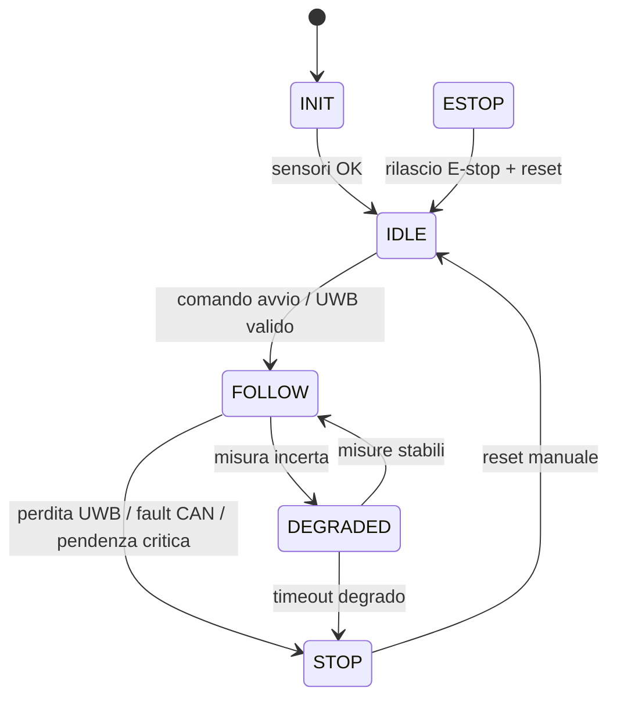

# Gallery Visuale Tecnica - Axiom MK0

Questa gallery raccoglie formati diversi per visualizzare e comunicare l'architettura MK0. Serve a scegliere lo strumento giusto a seconda del pubblico: officina, firmware, documentazione, revisione tecnica o presentazione.

## Tavole SVG

- [Layout dall'alto](diagrams/mk0_top_layout.svg)
- [Geometria UWB](diagrams/mk0_uwb_geometry.svg)
- [ToF e ostacoli in vista laterale](diagrams/mk0_side_tof_obstacle.svg)
- [Controllo e cablaggio logico](diagrams/mk0_control_wiring.svg)
- [Vista esplosa ponte corazzato](diagrams/mk0_exploded_drivetrain.svg)

## Modelli 3D e Disegni Meccanici CAD (SolidWorks & PNG)

Questi file contengono la modellazione tridimensionale originale e i disegni costruttivi del Mulo MK0, utili per l'officina, il tornitore e la verifica ingegneristica:

*   **Esploso 3D del Ponte Corazzato:**
    *   File Disegno: [ponte_corazzato_exploded_view.png](../hardware/cad/ponte_corazzato_exploded_view.png)
    *   *Descrizione:* Vista assonometrica esplosa in stile tavola tecnica che mostra l'asse coassiale di accoppiamento tra il motore, la piastra da 6 mm, il cuscinetto UCF204, l'albero custom e la ruota Cargo da 20".
*   **Modello dell'Albero Custom in SolidWorks (Tornitura):**
    *   File CAD: [albero_custom.SLDPRT](../hardware/cad/albero_custom.SLDPRT)
    *   *Descrizione:* Il file SolidWorks 3D originale del mozzo/albero custom in **42CrMo4** con la flangia a 6 fori integrata e il foro cieco da 14 mm per l'albero motore.
*   **Assieme Ruota e Mozzo:**
    *   File Disegno: [wheel_assembly.png](../hardware/cad/wheel_assembly.png)
    *   *Descrizione:* Dettaglio dell'accoppiamento tra la ruota da 20", il freno a disco da 203 mm e la flangia dell'albero di trasmissione.
*   **Struttura e Rinforzi del Telaio (SolidWorks & Layout):**
    *   File Telaio: [Parte3.SLDPRT](../../Parte3.SLDPRT) e [Parte4.SLDPRT](../../Parte4.SLDPRT) (nella root del progetto)
    *   Disegni Layout: [chassis_layout.png](../hardware/cad/chassis_layout.png) e [chassis_bracing.png](../hardware/cad/chassis_bracing.png)
    *   *Descrizione:* Modelli e render per la saldatura dei tubolari S235 da 30x30 mm e delle controventature diagonali del semitelaio.

## Linguaggi per schemi

### Mermaid

File: [mk0_firmware_state_machine.mmd](diagrams/mk0_firmware_state_machine.mmd)



### PlantUML

File: [mk0_fault_sequence.puml](diagrams/mk0_fault_sequence.puml)

Utile per rappresentare sequenze temporali: perdita UWB, fault CAN, stop conservativo, reset operatore e logging.

### Graphviz DOT

File: [mk0_signal_graph.dot](diagrams/mk0_signal_graph.dot)

Utile per grafi di dipendenza, priorita' dei segnali, relazioni tra sensori, MCU, VESC, potenza e safety.

## Dashboard HTML

File: [mk0_visual_dashboard.html](diagrams/mk0_visual_dashboard.html)

Pagina autonoma HTML/CSS per presentare il progetto senza strumenti esterni. Puo' essere aperta direttamente nel browser e usata come mini-tavola tecnica interattiva.

## Indice visuale cliccabile

File: [mk0_visual_index.html](diagrams/mk0_visual_index.html)

Indice locale con preview cliccabili delle tavole SVG, della dashboard e dei sorgenti Mermaid/PlantUML/Graphviz.

## Prompt per immagini fotorealistiche

Questi prompt sono pronti per un generatore bitmap quando serve un render visuale piu' realistico.

### Render prodotto

```text
Fotorealistic engineering product render of a compact four-wheel articulated trekking rover named Axiom MK0, steel square-tube chassis, four 20-inch cargo bicycle wheels, visible external flanged bearings, rugged mechanical disc brakes, front UWB anchors and small ToF sensors, sealed electronics boxes, matte industrial finish, realistic workshop lighting, clean technical background, no people, no logos, no text, high detail.
```

### Vista esplosa

```text
Technical exploded view of a rugged rover wheel drivetrain assembly: geared 24V motor, 6 mm steel mounting plate, custom 42CrMo4 extension shaft, external UCF204 flanged bearing, 203 mm brake disc, 20 inch cargo wheel hub, aligned on a common axis, clean white background, engineering manual style, realistic metal materials, no text labels.
```

### Scenario trekking

```text
Realistic outdoor scene of a compact autonomous follow-me trekking cargo rover on a mountain trail, four large 20-inch wheels, steel articulated chassis, carrying hiking equipment, following an operator at walking pace from behind, natural daylight, readable mechanical details, safe distance, no futuristic styling, no military appearance, no text.
```
