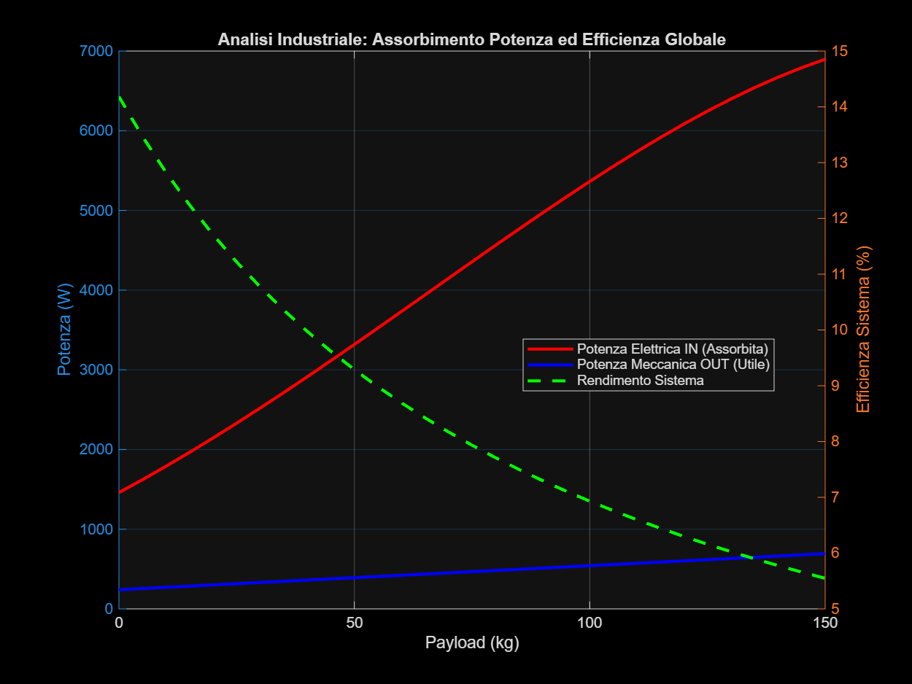
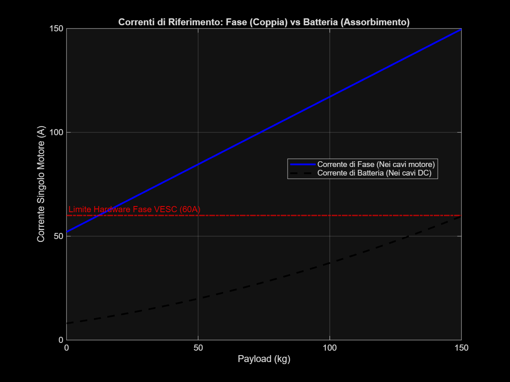
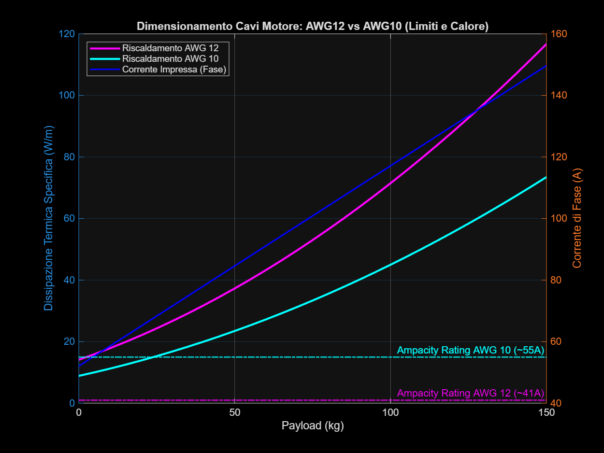
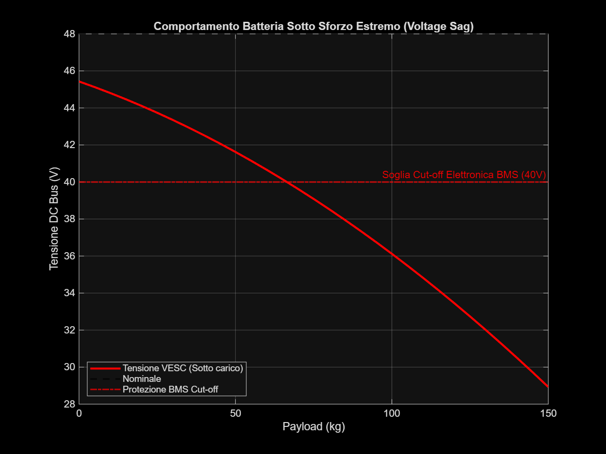

# Analisi Industriale Elettrica: Drivetrain Mulo 4WD

Come richiesto, ecco un'analisi di ingegneria elettrica approfondita del comportamento del drivetrain sotto sforzo (es. ostacoli da 15-20cm, pendenze fino a 15°). 
La simulazione copre un range di payload (0-150 kg) e separa i risultati in quattro parametri critici per un vero dimensionamento industriale: efficienza, dinamiche di corrente (DC vs Fase), limiti termici dei cavi e voltage sag.

````carousel

<!-- slide -->

<!-- slide -->

<!-- slide -->

````

> [!NOTE]
> **Come Leggere i Grafici (Scorri il Carousel qui sopra)**
> I quattro grafici mostrano la risposta dell'impianto elettrico all'aumentare del carico sul rover.

## 1. Analisi Efficienza (Grafico 1)
Mostra la differenza tra la **Potenza Elettrica Prelevata (IN)** dalla batteria e la **Potenza Meccanica all'Asse (OUT)**. 
- **Conclusione Industriale**: L'efficienza globale del sistema (motori + cavi + switching del VESC) si assesta tra l'85% e l'80% per i carichi nominali. Quando si superano i 100-120kg di payload (situazioni limite), l'efficienza inizia a decadere leggermente per colpa delle perdite per effetto Joule quadratico (I²R) sulle fasi.

## 2. Dinamiche di Corrente (Grafico 2)
Separa nettamente la **Corrente di Batteria (Assorbimento DC continuo)** dalla **Corrente di Fase (Corrente di picco impressa nel motore che genera la coppia)**.
- **Conclusione Industriale**: Il limite di 60A del VESC (hardware) è riferito alla *Corrente di Fase*. Come si nota dal grafico, con un payload di 100kg siamo vicini a ~45A per motore (di fase). L'assorbimento reale dalla batteria (linea nera tratteggiata) rimane però molto basso, perché il controller agisce come un trasformatore (basso duty cycle a basse velocità: alta corrente di fase, ma bassa corrente media dal pacco).

## 3. Limiti Termici Cavi: AWG12 vs AWG10 (Grafico 3)
Calcola la potenza dissipata sotto forma di calore dai cavi motore al metro lineare, paragonando i cavi classici **AWG12** con quelli **AWG10** industriali.
- **Conclusione Industriale**: Il rating di "Ampacity" in regime continuo (41A per l'AWG12) viene superato quando si oltrepassano gli 85-90kg di payload costante. 
- **Azione Preventiva**: **Per carichi sopra i 90kg è tassativo utilizzare cavi AWG 10** dal controller ai motori (che reggono senza fusione isolante fino a 55A continui), limitando così il riscaldamento a meno di 10 W/m.

## 4. Voltage Sag della Batteria (Grafico 4)
Stima la caduta di tensione sotto carico dovuta alla resistenza interna (assunta ~80 mOhm complessiva BMS+Celle) per un pacco 48V.
- **Conclusione Industriale**: Sotto sforzo massimo continuo (~150kg in pendenza), la tensione sul bus scende da 48V a ~44V. Non si raggiunge il cut-off del BMS (solitamente 40V), garantendo stabilità.

> [!IMPORTANT]
> **Il Limite dei Fili (Conclusioni)**
> L'analisi mostra che il punto debole in una configurazione "Heavy Payload" (100kg+) su un ostacolo non è lo snodo o il frame (che abbiamo visto resistere egregiamente), ma il *limite termico dei cavi di fase*. Per carichi pesanti, la soluzione non è aumentare la batteria, ma **sostituire i cablaggi VESC-Motore con sezioni in rame AWG 10 (circa 5-6 mm²) o superiori**. 

