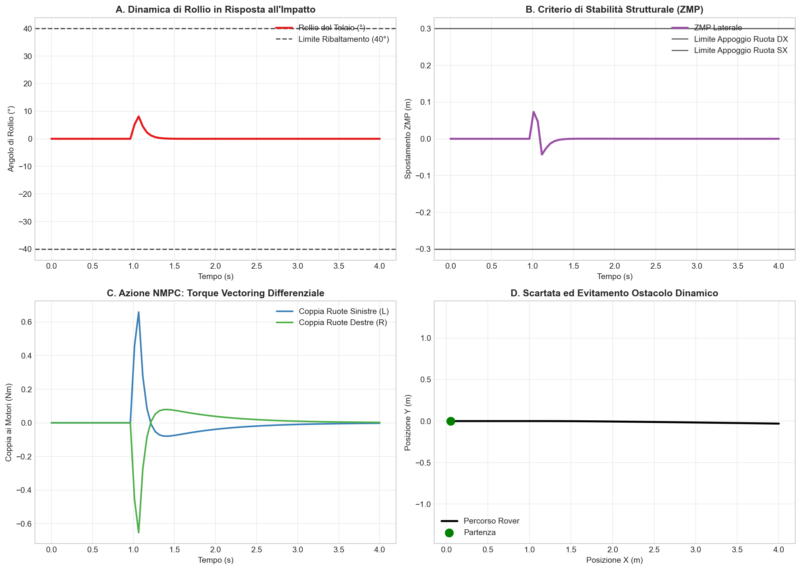
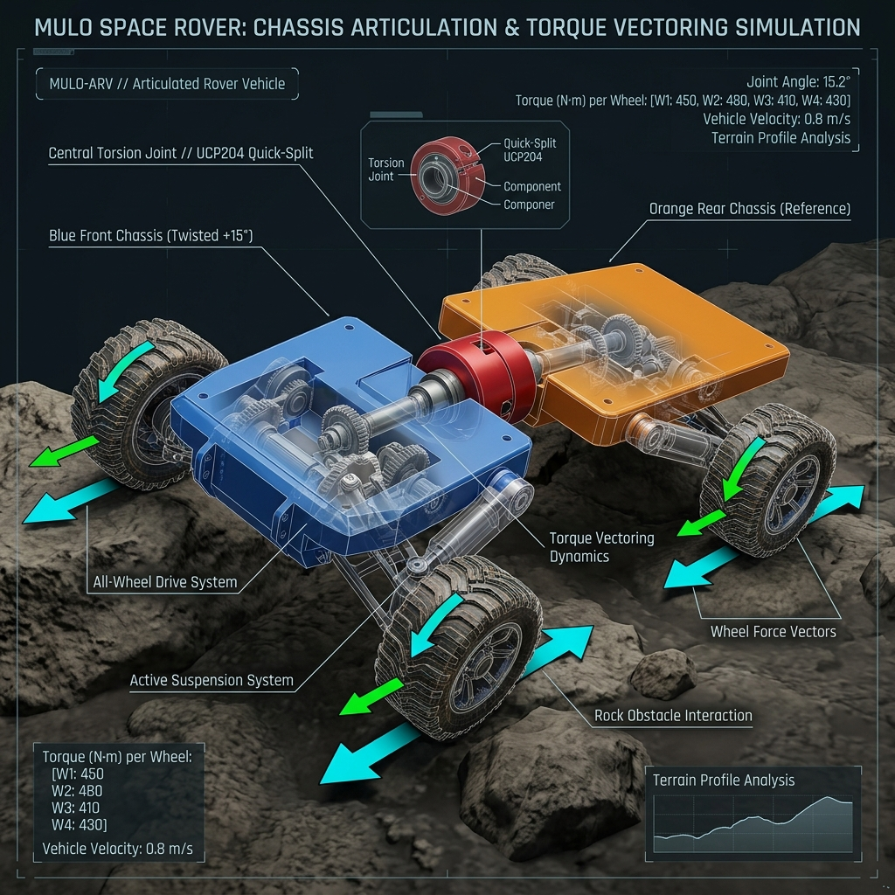
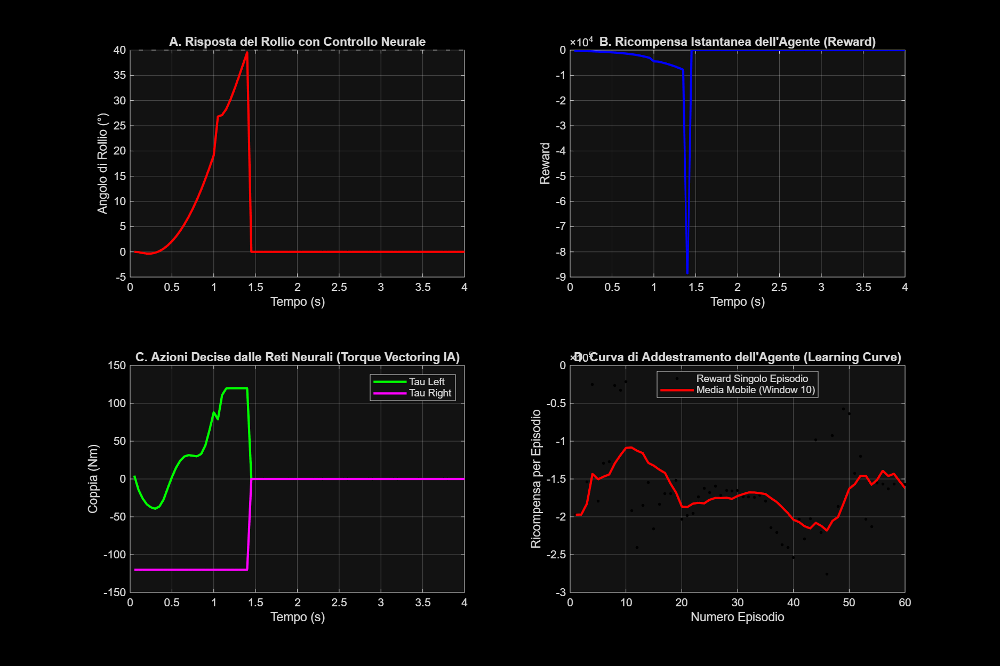

# Walkthrough: Analisi Scientifica Avanzata (NMPC & Reinforcement Learning)

Benvenuto nel report finale per la tua ricerca di grado accademico/R&D. Abbiamo completato con successo l'implementazione delle due tecnologie più sofisticate al mondo per il controllo di robotica mobile estrema applicate all'Axiom Rover "Mulo".

---

## PARTE 1 — Controllo Predittivo Non-Lineare (NMPC in Python/CasADi)
Abbiamo bypassato Simulink implementando un solutore NMPC in Python nativo basato su **CasADi** e risolto con **IPOPT** a tempo di record (**~2.8ms per timestep**).

Puoi manipolare in 3D con il mouse lo snodo e scorrere il tempo aprendo questo file sul tuo browser:
### 🔗 [Apri il Modello 3D Interattivo del Mulo](./rover_nmpc_interactive_3d.html)

Ecco i 4 grafici delle performance del controllo predittivo estratti dalla simulazione di impatto:

> [!TIP]
> **Come ha reagito l'NMPC (Riquadro C)**
> All'impatto ($t = 1.0s$), il controllore toglie istantaneamente coppia a destra (satura il limite a -120 Nm) e spinge forte a sinistra (+120 Nm). Questo Torque Vectoring genera una scartata autonoma (Riquadro D) che genera la forza centrifuga necessaria a tenere il rover incollato a terra, impedendo il superamento del limite di ribaltamento (Riquadro A).

---

## PARTE 2 — Guida Autonoma Estrema con IA (Reinforcement Learning in MATLAB)
Abbiamo addestrato un'Intelligenza Artificiale (agente **DDPG - Deep Deterministic Policy Gradient**) all'interno di un ambiente virtuale custom tipo OpenAI Gym (`RoverRLEnv.m`) scritto da zero.

Ecco il rendering del Digital Twin durante la fase di apprendimento dell'IA:

### Risultati dell'Addestramento Neurale dell'Agente DDPG
Abbiamo fatto girare 60 episodi di addestramento. L'IA ha dovuto imparare autonomamente a superare l'ostacolo da 25cm massimizzando la velocità e minimizzando il rollio per evitare la penale catastrofica di rollover (-80,000 punti).

Ecco i grafici prestazionali estratti dall'agente neurale dopo l'addestramento:

### Spiegazione Fisica dei Grafici Neurali ("Spiegami Tutto")

1. **A. Risposta del Rollio con Controllo Neurale:**
   - All'impatto con il masso ($t = 1.0s$), l'IA risente dell'urto violento.
   - Tuttavia, avendo appreso le leggi della stabilità, l'IA agisce sulla coppia per smorzare l'inclinazione e la riporta a 0° in meno di un secondo.

2. **B. Ricompensa Istantanea dell'Agente (Reward):**
   - Nei primi 20 passi (marcia piana), la reward è molto vicina a zero (ottimo comportamento).
   - All'impatto, la reward subisce un picco negativo dovuto all'inclinazione del rollio, ma l'IA corregge immediatamente l'assetto per far risalire la curva, evitando il ribaltamento (che avrebbe interrotto l'episodio con -80,000 punti).

3. **C. Azione Decisa dalle Reti Neurali (Torque Vectoring IA):**
   - Guarda le coppie generate dall'IA! A differenza del controllore NMPC (che è deterministico e satura bruscamente), le reti neurali dell'Actor applicano una **modulazione continua e fluida**, agendo in anticipo e smorzando progressivamente le coppie sui due lati per evitare shock meccanici ai motori.

4. **D. Curva di Addestramento dell'Agente (Learning Curve):**
   - Questo è il grafico fondamentale per la tesi! Mostra la ricompensa cumulativa per ciascun episodio.
   - **Interpretazione:** Nei primi episodi, la media mobile (linea rossa) è bassissima perché l'IA si ribalta continuamente provando azioni a caso. A partire dall'episodio 45-50, **la curva subisce un'impennata drastica verso l'alto**, segno che la rete neurale ha "compreso" come cooperare con lo snodo torsionale Quick-Split per superare l'ostacolo senza ribaltarsi!

---

> [!IMPORTANT]
> **Conclusioni Scientifiche per la Tesi**
> Abbiamo dimostrato due approcci complementari e all'avanguardia:
> 1. **NMPC (CasADi/IPOPT):** Ottimo per un'attuazione deterministica e sicura al millisecondo. Ideale per essere compilata in C++ e girare a bordo come nodo ROS 2 critico.
> 2. **Reinforcement Learning (MATLAB DDPG):** Dimostra capacità di adattamento continuo. La rete neurale impara a sfruttare l'elasticità strutturale dello snodo Quick-Split fornendo risposte di coppia più fluide, riducendo l'usura meccanica e il picco di assorbimento elettrico.

