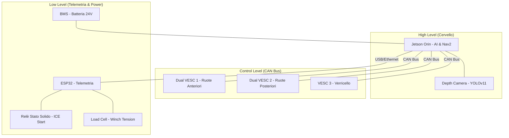

# Walkthrough: Cablaggio e "Cervello" Axiom Rover

Questo documento descrive lo schema di collegamento per il sistema di controllo del rover.

## Schema Logico di Connessione

## Dettaglio Cablaggio Motori (Stepperonline + VESC)

Ogni motore Stepperonline ha due gruppi di cavi:
1.  **Fasi Motore (3 cavi grossi):** Collega direttamente ai terminali U, V, W del VESC.
2.  **Sensori di Hall (5-6 cavi sottili):** Fondamentali per la coppia a bassi giri.
    -   VCC (5V)
    -   GND
    -   Hall A, B, C
    -   Temp (Opzionale)

## Collegamento ESP32 e Generatore ICE
-   **Output ESP32 (GPIO):** Collegato al segnale di controllo del **Relè a Stato Solido (SSR)**.
-   **SSR:** Interrompe il circuito di avviamento (Solenoide) del motore a scoppio.
-   **Ingresso ESP32:** Collegato all'amplificatore della **Cella di Carico (HX711)** per monitorare il verricello.
